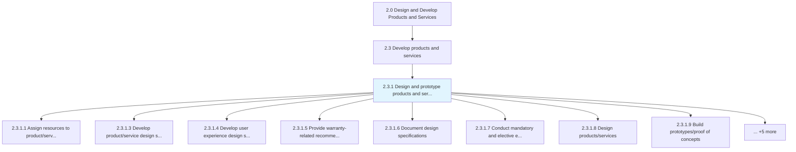
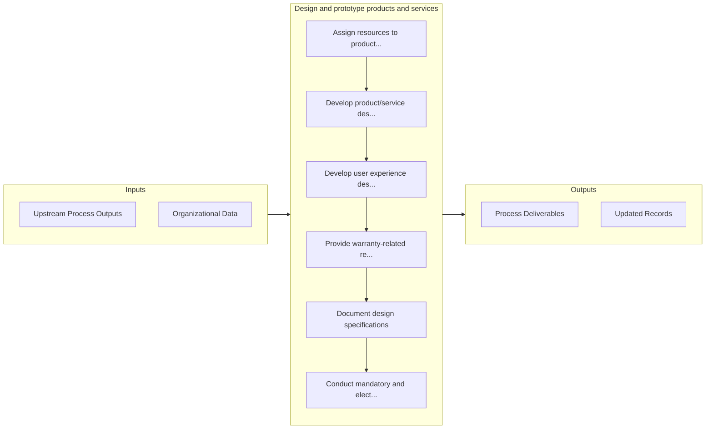

# Design and prototype products and services

> Sketching and standardizing product and service based on the market.

## Overview

Process 2.3.1 is a core process that defines the specific procedures for design and prototype products and services. 

Sketching and standardizing product and service based on the market. Analyze the data market competitiveness and innovation attained for the product and service development.

## Process Hierarchy



## Key Statistics

| Metric | Value |
|--------|-------|
| APQC Code | 19993 |
| Hierarchy ID | 2.3.1 |
| Level | Process |
| Parent | [2.3](../) |
| Sub-Processes | 13 |


## GraphDL Semantic Structure

```
design.AndPrototypeProductsAndServices
```

| Component | Value | Description |
|-----------|-------|-------------|
| Verb | `design` | Primary action |
| Object | `and prototype products and services` | Direct object |


## Process Flow



## Sub-Processes

| Process | Hierarchy ID | Description |
|---------|-------------|-------------|
| [Assign resources to product/service project](./2.3.1.1-AssignResourcesProductserviceProject/) | 2.3.1.1 | Allocating resources to the design, development, and evaluation of product/service concepts |
| [Develop product/service design specifications](./DevelopProductserviceDesignSpecifications) | 2.3.1.3 | Creating design specifications |
| [Develop user experience design specifications](./DevelopUserExperienceDesignSpecifications) | 2.3.1.4 | Determining the usability and user experience of products and the business impact it creates |
| [Provide warranty-related recommendations](./ProvideWarrantyrelatedRecommendations) | 2.3.1.5 | Providing warranty plan and pricing specifications for recommendation |
| [Document design specifications](./DocumentDesignSpecifications) | 2.3.1.6 | Documenting requirements to meet in the design of new or revised products/services |
| [Conduct mandatory and elective external reviews](./ConductMandatoryAndElectiveExternalReviews) | 2.3.1.7 | Conducting any mandatory and elective appraisals of the product/service design specifications in ord |
| [Design products/services](./2.3.1.8-DesignProductsservices/) | 2.3.1.8 | Creating a sketch of the customer focused product/service in Develop and Manage Products and Service |
| [Build prototypes/proof of concepts](./BuildPrototypesproofOfConcepts) | 2.3.1.9 | Building prototypes for shortlisted product/service concepts |
| [Develop and test prototype production and/or service delivery process](./DevelopAndTestPrototypeProductionAndorServiceDeliveryProcess) | 2.3.1.10 | Creating the new manufacturing/delivery processes for the new products/services, and testing them to |
| [Eliminate quality and reliability problems](./EliminateQualityAndReliabilityProblems) | 2.3.1.11 | Eliminating any problems relating to utility of the product/service over the course of its expected  |
| [Conduct in-house product/service testing and evaluate feasibility](./ConductInhouseProductserviceTestingAndEvaluateFeasibility) | 2.3.1.12 | Carrying out an in-house appraisal of the prototypes in order to validate design and feasibility |
| [Identify design/development performance indicators](./IdentifyDesigndevelopmentPerformanceIndicators) | 2.3.1.13 | Identifying performance parameters |
| [Collaborate on design with suppliers and external partners](./CollaborateOnDesignWithSuppliersAndExternalPartners) | 2.3.1.14 | Interacting with suppliers and manufactures to determine design decisions |


## Related Concepts

- PrototypeProducts
- Services


---

*Source: APQC PCF 19993 (2.3.1) - APQC*
