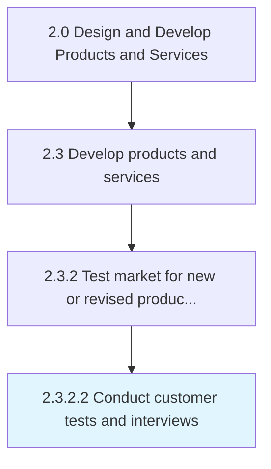

# Conduct customer tests and interviews

> Conducting both qualitative and quantitative studies to determine the fit between the newly developed products/services and the customers.

## Overview

Activity 2.3.2.2 is an activity within the Design and Develop Products and Services framework. 

Conducting both qualitative and quantitative studies to determine the fit between the newly developed products/services and the customers. Conduct external tests of the new product/service, and then refine them to maximize the customer uptake. Gather feedback from prospective customers and targeted populations by conducting surveys, focus groups, interviews, and detailed studies. Enlist professional services such as public relations or market research organizations.

## Process Hierarchy



## Key Statistics

| Metric | Value |
|--------|-------|
| APQC Code | 10094 |
| Hierarchy ID | 2.3.2.2 |
| Level | Activity |
| Parent | [2.3.2](../) |
| Sub-Processes | 0 |


## GraphDL Semantic Structure

```
conduct.CustomerTestsAndInterviews
```

| Component | Value | Description |
|-----------|-------|-------------|
| Verb | `conduct` | Primary action |
| Object | `customer tests and interviews` | Direct object |


## Related Concepts

- CustomerTests
- Interviews


---

*Source: APQC PCF 10094 (2.3.2.2) - APQC*
