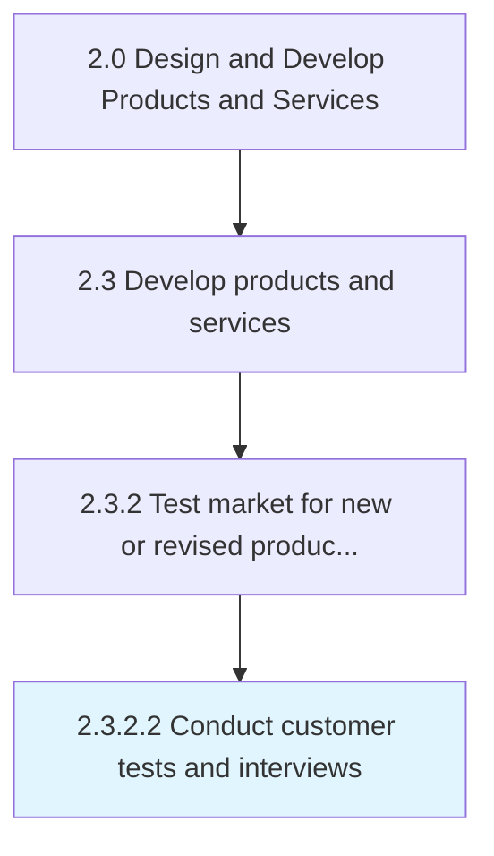
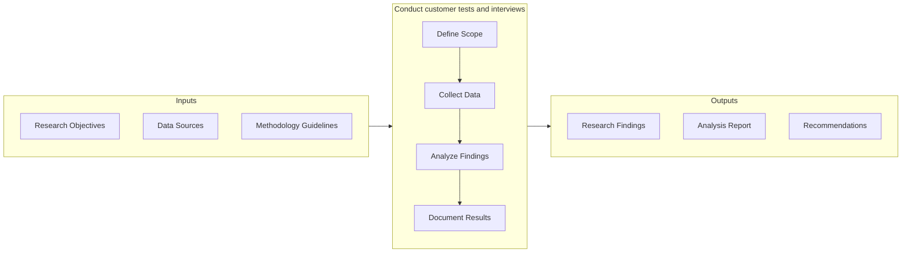

# Conduct customer tests and interviews

> Conducting both qualitative and quantitative studies to determine the fit between the newly developed products/services and the customers.

## Overview

Activity 2.3.2.2 is an activity within the Design and Develop Products and Services framework. 

Conducting both qualitative and quantitative studies to determine the fit between the newly developed products/services and the customers. Conduct external tests of the new product/service, and then refine them to maximize the customer uptake. Gather feedback from prospective customers and targeted populations by conducting surveys, focus groups, interviews, and detailed studies. Enlist professional services such as public relations or market research organizations.

This activity is critical to ensuring that products and services meet established quality benchmarks before advancing through subsequent development stages. It involves systematic evaluation against predefined criteria, cross-functional collaboration to address identified gaps, and documentation of findings to support continuous improvement. The process draws on both quantitative metrics and qualitative assessments from subject matter experts.

## Process Hierarchy



## Key Statistics

| Metric | Value |
|--------|-------|
| APQC Code | 10094 |
| Hierarchy ID | 2.3.2.2 |
| Level | Activity |
| Parent | [2.3.2](../) |
| Sub-Processes | 0 |


## GraphDL Semantic Structure

```graphdl
conduct.CustomerTestsAndInterviews
```

| Component | Value | Description |
|-----------|-------|-------------|
| Verb | `conduct` | Primary action |
| Object | `customer tests and interviews` | Direct object |


## Related Concepts

- CustomerTests
- Interviews


## Process Flow



## RACI Matrix

| Activity | Responsible | Accountable | Consulted | Informed |
|----------|-------------|-------------|-----------|----------|
| Design and develop | Engineering Team | Engineering Manager | Product Manager | Quality Assurance |
| Test and validate | QA Engineer | Quality Manager | Product Designer | Product Manager |
| Approve and release | Engineering Manager | VP of Engineering | Operations | All Stakeholders |

## Related Occupations

- [Product Designer](/occupations/ArtsAndDesign/IndustrialDesigners) - Designs and prototypes product solutions
- [Engineering Manager](/occupations/Management/IndustrialProductionManagers) - Oversees development and production readiness
- [Quality Engineer](/occupations/Architecture/IndustrialEngineers) - Validates quality and reliability of prototypes
- [Supply Chain Analyst](/occupations/BusinessAndFinancial/LogisticsAnalysts) - Evaluates production and delivery feasibility
- [Test Engineer](/occupations/Computer/SoftwareQualityAssurance) - Conducts product testing and validation

## Related Departments

- [Engineering](/departments/Technology) - Designs, prototypes, and validates products
- [Operations](/departments/Operations) - Prepares production and service delivery processes
- Quality Assurance - Tests and validates product quality

## Industry Variations

### Retail

Market testing focuses on consumer behavior analysis, seasonal demand patterns, and omnichannel launch readiness across physical and digital storefronts.

### Consumer Products

Extensive focus group testing, packaging evaluation, and shelf-placement strategy drive market introduction decisions.

### Technology

Beta programs, early adopter feedback loops, and agile launch iterations with continuous deployment characterize the market introduction approach.

## KPIs & Metrics

| Metric | Description | Target |
|--------|-------------|--------|
| Defect Rate | Percentage of defects identified per review cycle | < 2% |
| Review Cycle Time | Average time to complete review process | < 5 business days |
| First Pass Yield | Percentage of items passing review on first attempt | > 85% |

---

*Source: APQC PCF 10094 (2.3.2.2) - APQC*
