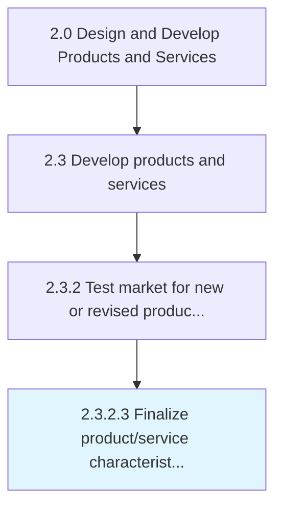

# Finalize product/service characteristics and business cases

> Finalizing the characteristics of new products/services by appropriately weighing feedback from prospective customers against a cost-benefit analysis in order to produce a profitable business proposition.

## Overview

Activity 2.3.2.3 is an activity within the Design and Develop Products and Services framework. 

Finalizing the characteristics of new products/services by appropriately weighing feedback from prospective customers against a cost-benefit analysis in order to produce a profitable business proposition. Refine the attributes of the newly developed products/services, in light of the feedback and insights collected during Conduct customer tests and interviews [10094]. Revisit the high-level business case to justify the resources assigned to the product/service project against the anticipated benefits.

## Process Hierarchy



## Key Statistics

| Metric | Value |
|--------|-------|
| APQC Code | 10095 |
| Hierarchy ID | 2.3.2.3 |
| Level | Activity |
| Parent | [2.3.2](../) |
| Sub-Processes | 0 |


## GraphDL Semantic Structure

```
finalize.ProductserviceCharacteristicsAndBusinessCases
```

| Component | Value | Description |
|-----------|-------|-------------|
| Verb | `finalize` | Primary action |
| Object | `product/service characteristics and business cases` | Direct object |


## Related Concepts

- ProductCharacteristicsCases
- ServiceCharacteristicsCases
- BusinessCases


---

*Source: APQC PCF 10095 (2.3.2.3) - APQC*
