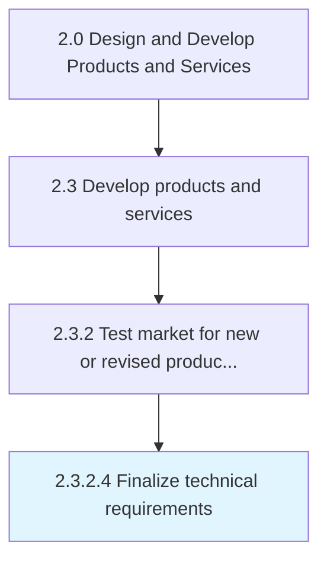

# Finalize technical requirements

> Reassessing the technical requirements in light of the final product/service attributes.

## Overview

Activity 2.3.2.4 is an activity within the Design and Develop Products and Services framework. 

Reassessing the technical requirements in light of the final product/service attributes. Revisit the technical assessment to revalidate the organization's capacity for progressing with new product/service projects, in light of the revised product/service characteristics.

## Process Hierarchy



## Key Statistics

| Metric | Value |
|--------|-------|
| APQC Code | 10096 |
| Hierarchy ID | 2.3.2.4 |
| Level | Activity |
| Parent | [2.3.2](../) |
| Sub-Processes | 0 |


## GraphDL Semantic Structure

```
finalize.TechnicalRequirements
```

| Component | Value | Description |
|-----------|-------|-------------|
| Verb | `finalize` | Primary action |
| Object | `technical requirements` | Direct object |


## Related Concepts

- [TechnicalRequirements](/concepts/TechnicalRequirements)


---

*Source: APQC PCF 10096 (2.3.2.4) - APQC*
