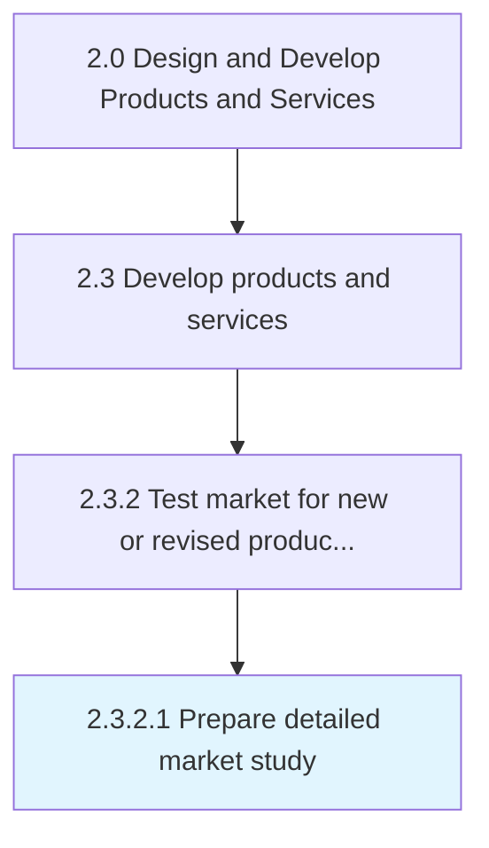
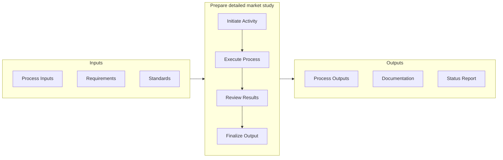

# Prepare detailed market study

> Composing a detailed study of the market ecosystem in light of new products/services.

## Overview

Activity 2.3.2.1 is an activity within the Design and Develop Products and Services framework. 

Composing a detailed study of the market ecosystem in light of new products/services. Conduct a detailed analysis of the targeted market(s) in order to Introduce new products/services [10077]. Examine the competition, market size and growth rate, market trends, customer segments and their characteristics, market influencers, distribution channels, and profitability. Enlist in-house marketing and/or solutioning teams, or outsource to specialized professional services agencies.

This activity bridges the gap between product development and commercial availability by validating market readiness and executing go-to-market strategies. It requires coordination across product, marketing, sales, and operations teams to ensure a successful introduction. Key considerations include competitive positioning, channel readiness, and customer communication planning.

## Process Hierarchy



## Key Statistics

| Metric | Value |
|--------|-------|
| APQC Code | 10093 |
| Hierarchy ID | 2.3.2.1 |
| Level | Activity |
| Parent | [2.3.2](../) |
| Sub-Processes | 0 |


## GraphDL Semantic Structure

```graphdl
prepare.DetailedMarketStudy
```

| Component | Value | Description |
|-----------|-------|-------------|
| Verb | `prepare` | Primary action |
| Object | `detailed market study` | Direct object |


## Related Concepts

- DetailedMarketStudy


## Process Flow



## RACI Matrix

| Activity | Responsible | Accountable | Consulted | Informed |
|----------|-------------|-------------|-----------|----------|
| Design and develop | Engineering Team | Engineering Manager | Product Manager | Quality Assurance |
| Test and validate | QA Engineer | Quality Manager | Product Designer | Product Manager |
| Approve and release | Engineering Manager | VP of Engineering | Operations | All Stakeholders |

## Related Occupations

- [Product Designer](/occupations/ArtsAndDesign/IndustrialDesigners) - Designs and prototypes product solutions
- [Engineering Manager](/occupations/Management/IndustrialProductionManagers) - Oversees development and production readiness
- [Quality Engineer](/occupations/Architecture/IndustrialEngineers) - Validates quality and reliability of prototypes
- [Supply Chain Analyst](/occupations/BusinessAndFinancial/LogisticsAnalysts) - Evaluates production and delivery feasibility

## Related Departments

- [Engineering](/departments/Technology) - Designs, prototypes, and validates products
- [Operations](/departments/Operations) - Prepares production and service delivery processes
- Quality Assurance - Tests and validates product quality

## Industry Variations

### Retail

Market testing focuses on consumer behavior analysis, seasonal demand patterns, and omnichannel launch readiness across physical and digital storefronts.

### Consumer Products

Extensive focus group testing, packaging evaluation, and shelf-placement strategy drive market introduction decisions.

### Technology

Beta programs, early adopter feedback loops, and agile launch iterations with continuous deployment characterize the market introduction approach.

## KPIs & Metrics

| Metric | Description | Target |
|--------|-------------|--------|
| Time to Market | Duration from concept to market availability | Per product roadmap |
| Launch Success Rate | Percentage of launches meeting revenue targets | > 70% |
| Customer Adoption Rate | New customer uptake within first quarter | > 15% |

---

*Source: APQC PCF 10093 (2.3.2.1) - APQC*
