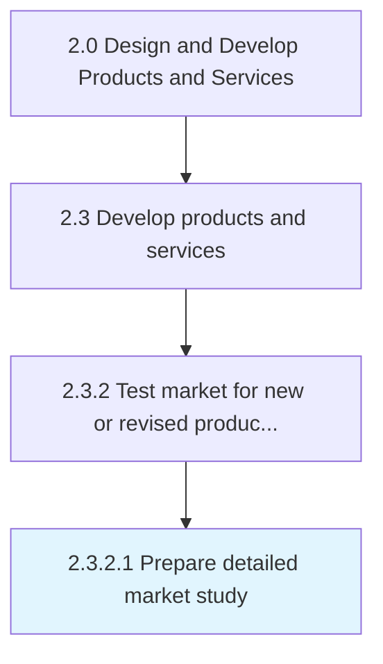

# Prepare detailed market study

> Composing a detailed study of the market ecosystem in light of new products/services.

## Overview

Activity 2.3.2.1 is an activity within the Design and Develop Products and Services framework. 

Composing a detailed study of the market ecosystem in light of new products/services. Conduct a detailed analysis of the targeted market(s) in order to Introduce new products/services [10077]. Examine the competition, market size and growth rate, market trends, customer segments and their characteristics, market influencers, distribution channels, and profitability. Enlist in-house marketing and/or solutioning teams, or outsource to specialized professional services agencies.

## Process Hierarchy



## Key Statistics

| Metric | Value |
|--------|-------|
| APQC Code | 10093 |
| Hierarchy ID | 2.3.2.1 |
| Level | Activity |
| Parent | [2.3.2](../) |
| Sub-Processes | 0 |


## GraphDL Semantic Structure

```
prepare.DetailedMarketStudy
```

| Component | Value | Description |
|-----------|-------|-------------|
| Verb | `prepare` | Primary action |
| Object | `detailed market study` | Direct object |


## Related Concepts

- [DetailedMarketStudy](/concepts/DetailedMarketStudy)


---

*Source: APQC PCF 10093 (2.3.2.1) - APQC*
