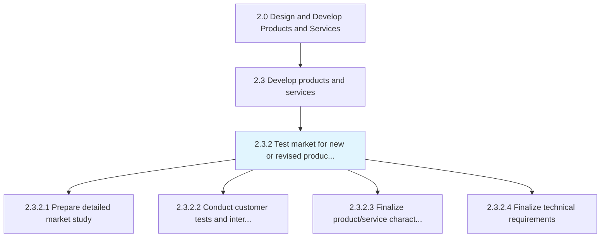
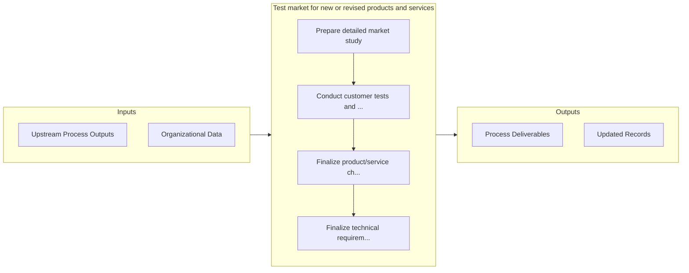

# Test market for new or revised products and services

> Expanding on the marketplace analysis that took place earlier in the product development lifecycle by testing the market against offerings.

## Overview

Process 2.3.2 is a core process that defines the specific procedures for test market for new or revised products and services. 

Expanding on the marketplace analysis that took place earlier in the product development lifecycle by testing the market against offerings. The results from this in-depth analysis will help the organization finalize product/service characteristics and technical requirements and also identify any needed changes in the manufacturing and delivery processes that support market delivery. To prepare a detailed market study that accounts for any changes in the global environment, the organization may want to conduct a series of interviews, workshops, and focus groups with potential and existing customers.

## Process Hierarchy



## Key Statistics

| Metric | Value |
|--------|-------|
| APQC Code | 19996 |
| Hierarchy ID | 2.3.2 |
| Level | Process |
| Parent | [2.3](../) |
| Sub-Processes | 4 |


## GraphDL Semantic Structure

```
test.Market.for.NewOrRevisedProductsAndServices
```

| Component | Value | Description |
|-----------|-------|-------------|
| Verb | `test` | Primary action |
| Object | `market` | Direct object |
| Preposition | `for` | Relationship |
| PrepObject | `new or revised products and services` | Indirect object |


## Process Flow



## Sub-Processes

| Process | Hierarchy ID | Description |
|---------|-------------|-------------|
| [Prepare detailed market study](./PrepareDetailedMarketStudy) | 2.3.2.1 | Composing a detailed study of the market ecosystem in light of new products/services |
| [Conduct customer tests and interviews](./ConductCustomerTestsAndInterviews) | 2.3.2.2 | Conducting both qualitative and quantitative studies to determine the fit between the newly develope |
| [Finalize product/service characteristics and business cases](./FinalizeProductserviceCharacteristicsAndBusinessCases) | 2.3.2.3 | Finalizing the characteristics of new products/services by appropriately weighing feedback from pros |
| [Finalize technical requirements](./FinalizeTechnicalRequirements) | 2.3.2.4 | Reassessing the technical requirements in light of the final product/service attributes |


## Related Concepts

- [Market](/concepts/Market)
- [New](/concepts/New)
- [Market](/concepts/Market)
- [RevisedProducts](/concepts/RevisedProducts)
- [Market](/concepts/Market)
- [Services](/concepts/Services)


---

*Source: APQC PCF 19996 (2.3.2) - APQC*
