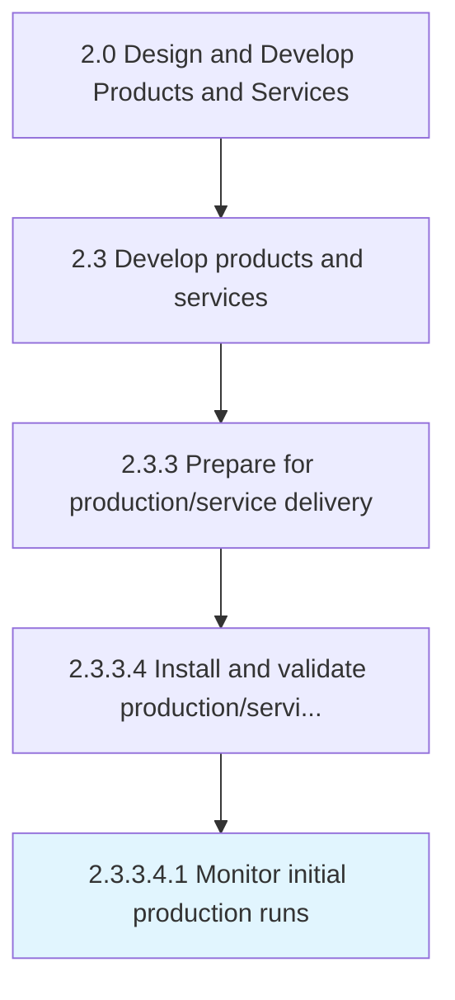

# Monitor initial production runs

> Regularly monitoring production runs of the production and/or delivery operations.

## Overview

Sub-Activity 2.3.3.4.1 is an activity within the Design and Develop Products and Services framework. 

Regularly monitoring production runs of the production and/or delivery operations.

## Process Hierarchy



## Key Statistics

| Metric | Value |
|--------|-------|
| APQC Code | 11417 |
| Hierarchy ID | 2.3.3.4.1 |
| Level | Sub-Activity |
| Parent | [2.3.3.4](../) |
| Sub-Processes | 0 |


## GraphDL Semantic Structure

```
monitor.InitialProductionRuns
```

| Component | Value | Description |
|-----------|-------|-------------|
| Verb | `monitor` | Primary action |
| Object | `initial production runs` | Direct object |


## Related Concepts

- [InitialProductionRuns](/concepts/InitialProductionRuns)


---

*Source: APQC PCF 11417 (2.3.3.4.1) - APQC*
