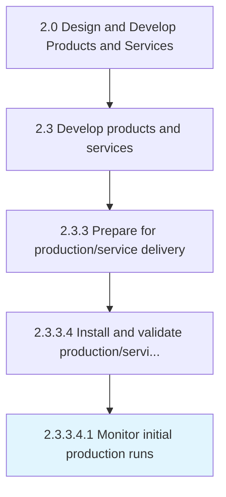
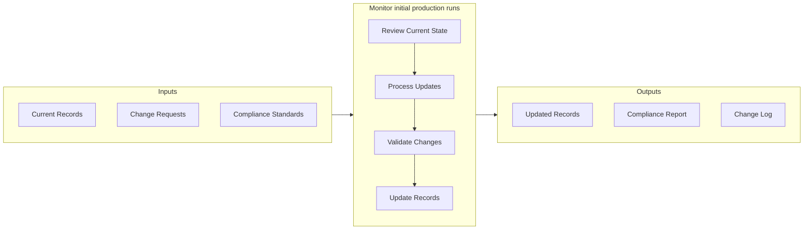

# Monitor initial production runs

> Regularly monitoring production runs of the production and/or delivery operations.

## Overview

Sub-Activity 2.3.3.4.1 is an activity within the Design and Develop Products and Services framework. 

Regularly monitoring production runs of the production and/or delivery operations.

This activity confirms that systems, processes, and outputs perform as intended under operational conditions. It involves systematic verification against acceptance criteria, documentation of test results, and resolution of any discrepancies identified during validation. Successful completion of this process provides the confidence needed to proceed to full-scale operation.

## Process Hierarchy



## Key Statistics

| Metric | Value |
|--------|-------|
| APQC Code | 11417 |
| Hierarchy ID | 2.3.3.4.1 |
| Level | Sub-Activity |
| Parent | [2.3.3.4](../) |
| Sub-Processes | 0 |


## GraphDL Semantic Structure

```
monitor.InitialProductionRuns
```

| Component | Value | Description |
|-----------|-------|-------------|
| Verb | `monitor` | Primary action |
| Object | `initial production runs` | Direct object |


## Related Concepts

- InitialProductionRuns


## Process Flow



## RACI Matrix

| Activity | Responsible | Accountable | Consulted | Informed |
|----------|-------------|-------------|-----------|----------|
| Design and develop | Engineering Team | Engineering Manager | Product Manager | Quality Assurance |
| Test and validate | QA Engineer | Quality Manager | Product Designer | Product Manager |
| Approve and release | Engineering Manager | VP of Engineering | Operations | All Stakeholders |

## Related Occupations

- [Product Designer](/occupations/ArtsAndDesign/IndustrialDesigners) - Designs and prototypes product solutions
- [Engineering Manager](/occupations/Management/IndustrialProductionManagers) - Oversees development and production readiness
- [Quality Engineer](/occupations/Architecture/IndustrialEngineers) - Validates quality and reliability of prototypes
- [Supply Chain Analyst](/occupations/BusinessAndFinancial/LogisticsAnalysts) - Evaluates production and delivery feasibility

## Related Departments

- [Engineering](/departments/Engineering) - Designs, prototypes, and validates products
- [Operations](/departments/Operations) - Prepares production and service delivery processes
- [Quality Assurance](/departments/QualityAssurance) - Tests and validates product quality

## Industry Variations

### Manufacturing

Emphasizes physical product specifications, tooling requirements, and lean production principles in process execution.

### Technology

Focuses on agile development methodologies, continuous integration, and rapid iteration cycles with digital-first delivery.

### Healthcare

Requires adherence to patient safety standards, clinical efficacy validation, and comprehensive regulatory documentation.

## KPIs & Metrics

| Metric | Description | Target |
|--------|-------------|--------|
| Process Cycle Time | Average duration to complete this activity | < 10 business days |
| Completion Rate | Percentage of activities completed on schedule | > 90% |
| Stakeholder Satisfaction | Internal satisfaction score for process outputs | > 4.0/5.0 |

---

*Source: APQC PCF 11417 (2.3.3.4.1) - APQC*
