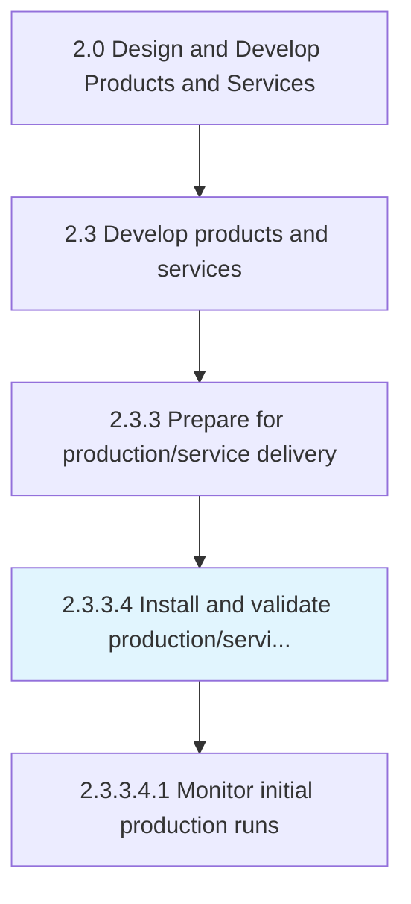
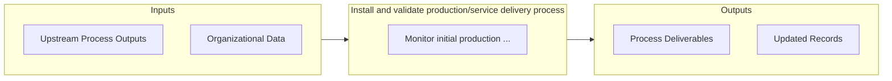

# Install and validate production/service delivery process

> Finalizing production process or methodology.

## Overview

Activity 2.3.3.4 is an activity within the Design and Develop Products and Services framework. 

Finalizing production process or methodology. Install and initiate the production process to manufacture the new products, using the equipment and machinery already assembled. In the case of new services, implement delivery processes and methodologies. Validate processes for the accuracy of their operation and proper functioning.

## Process Hierarchy



## Key Statistics

| Metric | Value |
|--------|-------|
| APQC Code | 10100 |
| Hierarchy ID | 2.3.3.4 |
| Level | Activity |
| Parent | [2.3.3](../) |
| Sub-Processes | 1 |


## Process Overview

Product development processes design, develop, and introduce new products and services to meet customer needs. This process focuses on install and validate production/service delivery process, which is essential for organizational effectiveness and achieving business objectives.

## Key Metrics

| Metric | Description | Target |
|--------|-------------|--------|
| Time to market | Measure of time to market | Target varies by organization |
| Product success rate | Measure of product success rate | Target varies by organization |
| R&D ROI | Measure of r&d roi | Target varies by organization |
| Patent filings | Measure of patent filings | Target varies by organization |

## Related Departments

- [Product](/departments/Product)
- [Research](/departments/Research)
- [Quality](/departments/Quality)

## Related Occupations

- [Product Managers](/occupations/Management/ProductManagers)
- [Industrial Engineers](/occupations/Engineering/IndustrialEngineers)
- [Quality Control Managers](/occupations/Management/QualityControlManagers)

## RACI Matrix

| Activity | Responsible | Accountable | Consulted | Informed |
|----------|-------------|-------------|-----------|----------|
| Plan | Process Owner | Manager | Stakeholders | Team |
| Execute | Team | Process Owner | Manager | Stakeholders |
| Monitor | Analyst | Manager | Process Owner | Leadership |
| Improve | Process Owner | Manager | Team | Stakeholders |

## GraphDL Semantic Structure

```graphdl
install.AndValidateProductionserviceDeliveryProcess
```

| Component | Value | Description |
|-----------|-------|-------------|
| Verb | `install` | Primary action |
| Object | `and validate production/service delivery process` | Direct object |


## Process Flow



## Sub-Processes

| Process | Hierarchy ID | Description |
|---------|-------------|-------------|
| [Monitor initial production runs](./MonitorInitialProductionRuns) | 2.3.3.4.1 | Regularly monitoring production runs of the production and/or delivery operations |


## Related Concepts

- ProductionDeliveryProcess
- ServiceDeliveryProcess
- ProductionDeliveryProcess
- ServiceDeliveryProcess


---

*Source: APQC PCF 10100 (2.3.3.4) - APQC*
