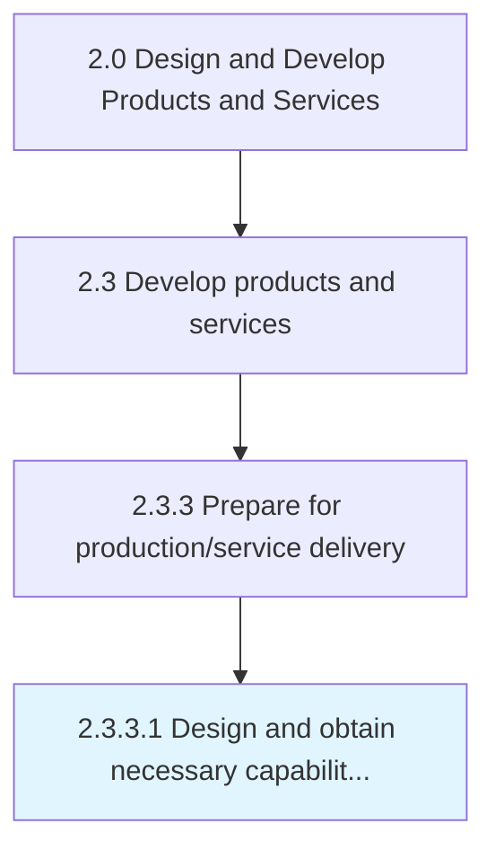

# Design and obtain necessary capabilities/materials and equipment

> Developing and/or sourcing the essential machinery needed for creating purpose-built processes, as well as the raw materials, to produce the new products/services.

## Overview

Activity 2.3.3.1 is an activity within the Design and Develop Products and Services framework. 

Developing and/or sourcing the essential machinery needed for creating purpose-built processes, as well as the raw materials, to produce the new products/services. Either design the equipment and materials needed internally, or source from external vendors. Obtain the feedstock or raw materials needed to prepare the finished products, as well as the machinery - hardware and software - needed to arrange production lines, factory operations, assemblies, and manufacturing processes. Revisit the technologies that underpin the new or revised products/services in order to source the right equipment and materials.

## Process Hierarchy



## Key Statistics

| Metric | Value |
|--------|-------|
| APQC Code | 10099 |
| Hierarchy ID | 2.3.3.1 |
| Level | Activity |
| Parent | [2.3.3](../) |
| Sub-Processes | 0 |


## GraphDL Semantic Structure

```
design.AndObtainNecessaryCapabilitiesmaterialsAndEquipment
```

| Component | Value | Description |
|-----------|-------|-------------|
| Verb | `design` | Primary action |
| Object | `and obtain necessary capabilities/materials and equipment` | Direct object |


## Related Concepts

- [NecessaryCapabilities](/concepts/NecessaryCapabilities)
- [NecessaryMaterials](/concepts/NecessaryMaterials)
- [Equipment](/concepts/Equipment)
- [NecessaryCapabilities](/concepts/NecessaryCapabilities)
- [NecessaryMaterials](/concepts/NecessaryMaterials)
- [Equipment](/concepts/Equipment)


---

*Source: APQC PCF 10099 (2.3.3.1) - APQC*
