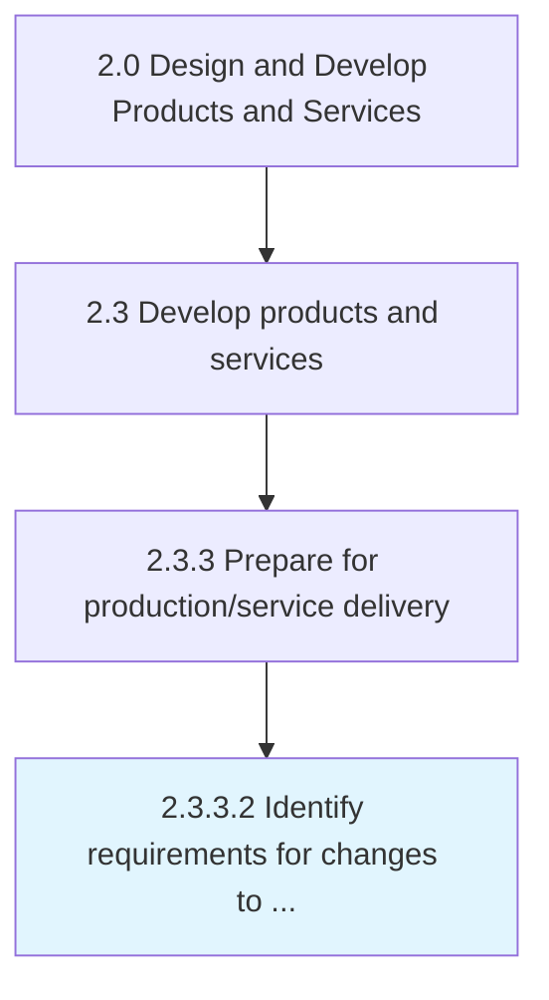

# Identify requirements for changes to manufacturing/delivery processes

> Identifying any changes that need to be effectuated in the organization's internal processes for manufacturing, and delivering the newly developed products/services.

## Overview

Activity 2.3.3.2 is an activity within the Design and Develop Products and Services framework. 

Identifying any changes that need to be effectuated in the organization's internal processes for manufacturing, and delivering the newly developed products/services. Determine if any changes need to be made to the production and distribution processes, in light of the new products/services. Begin production process planning. Prepare for factory layout planning. Generate shop-floor instructions and changes to the supply chain.

## Process Hierarchy



## Key Statistics

| Metric | Value |
|--------|-------|
| APQC Code | 10097 |
| Hierarchy ID | 2.3.3.2 |
| Level | Activity |
| Parent | [2.3.3](../) |
| Sub-Processes | 0 |


## GraphDL Semantic Structure

```
identify.Requirements.for.ChangesToManufacturingdeliveryProcesses
```

| Component | Value | Description |
|-----------|-------|-------------|
| Verb | `identify` | Primary action |
| Object | `requirements` | Direct object |
| Preposition | `for` | Relationship |
| PrepObject | `changes to manufacturing/delivery processes` | Indirect object |


## Related Concepts

- Requirements
- ChangesToManufacturingProcesses
- Requirements
- ChangesToDeliveryProcesses


---

*Source: APQC PCF 10097 (2.3.3.2) - APQC*
