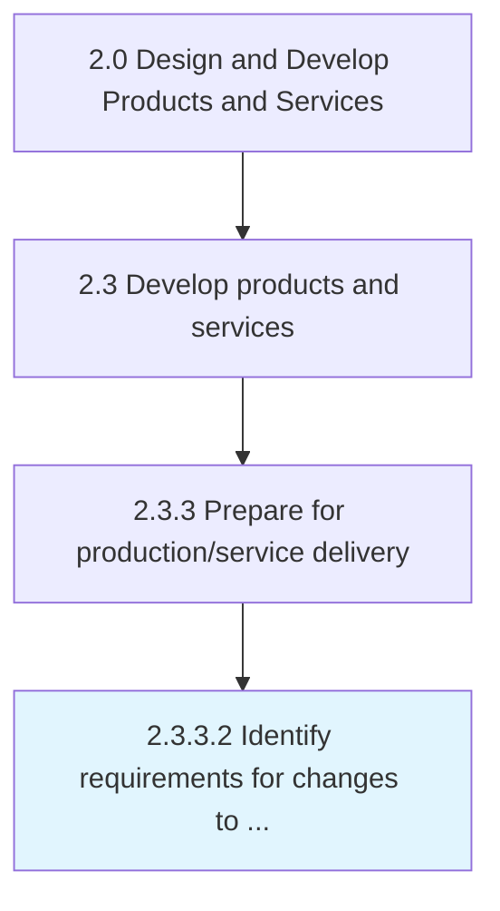
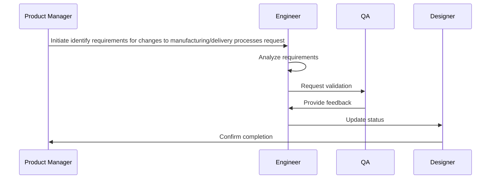

# Identify requirements for changes to manufacturing/delivery processes

> Identifying any changes that need to be effectuated in the organization's internal processes for manufacturing, and delivering the newly developed products/services.

## Overview

Activity 2.3.3.2 is an activity within the Design and Develop Products and Services framework. 

Identifying any changes that need to be effectuated in the organization's internal processes for manufacturing, and delivering the newly developed products/services. Determine if any changes need to be made to the production and distribution processes, in light of the new products/services. Begin production process planning. Prepare for factory layout planning. Generate shop-floor instructions and changes to the supply chain.

## Process Hierarchy



## Key Statistics

| Metric | Value |
|--------|-------|
| APQC Code | 10097 |
| Hierarchy ID | 2.3.3.2 |
| Level | Activity |
| Parent | [2.3.3](../) |
| Sub-Processes | 0 |


## Process Overview

Product development processes design, develop, and introduce new products and services to meet customer needs. This process focuses on identify requirements for changes to manufacturing/delivery processes, which is essential for organizational effectiveness and achieving business objectives.

## Key Metrics

| Metric | Description | Target |
|--------|-------------|--------|
| Time to market | Measure of time to market | Target varies by organization |
| Product success rate | Measure of product success rate | Target varies by organization |
| R&D ROI | Measure of r&d roi | Target varies by organization |
| Patent filings | Measure of patent filings | Target varies by organization |

## Related Departments

- [Product](/departments/Product)
- [Research](/departments/Research)
- [Quality](/departments/Quality)

## Related Occupations

- [Product Managers](/occupations/Management/ProductManagers)
- [Industrial Engineers](/occupations/Engineering/IndustrialEngineers)
- [Quality Control Managers](/occupations/Management/QualityControlManagers)

## RACI Matrix

| Activity | Responsible | Accountable | Consulted | Informed |
|----------|-------------|-------------|-----------|----------|
| Plan | Process Owner | Manager | Stakeholders | Team |
| Execute | Team | Process Owner | Manager | Stakeholders |
| Monitor | Analyst | Manager | Process Owner | Leadership |
| Improve | Process Owner | Manager | Team | Stakeholders |

## GraphDL Semantic Structure

```graphdl
identify.Requirements.for.ChangesToManufacturingdeliveryProcesses
```

| Component | Value | Description |
|-----------|-------|-------------|
| Verb | `identify` | Primary action |
| Object | `requirements` | Direct object |
| Preposition | `for` | Relationship |
| PrepObject | `changes to manufacturing/delivery processes` | Indirect object |


## Process Sequence


## Related Concepts

- Requirements
- ChangesToManufacturingProcesses
- Requirements
- ChangesToDeliveryProcesses


---

*Source: APQC PCF 10097 (2.3.3.2) - APQC*
