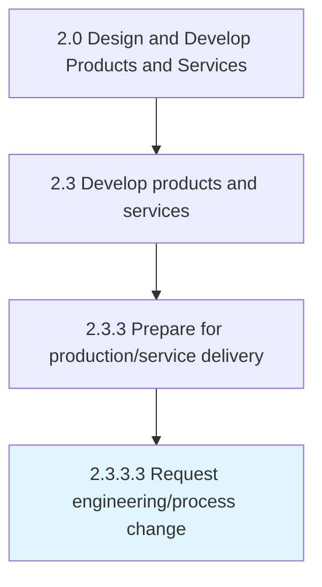
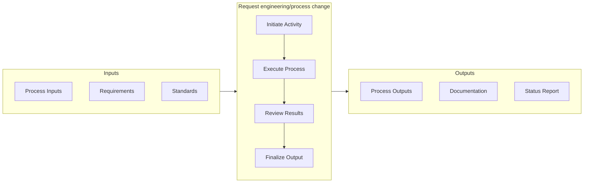

# Request engineering/process change

> Requesting changes in the production and/or delivery operations for processing the new or revised products/services.

## Overview

Activity 2.3.3.3 is an activity within the Design and Develop Products and Services framework. 

Requesting changes in the production and/or delivery operations for processing the new or revised products/services. Rectify any problems identified in the manufacturing or delivery processes (through Monitor production runs [11417]). Seek changes in components, repair machinery, optimize production lines, and tweak factory assemblies through a formal notice to the concerned division, known as an engineering change order.

This activity provides a structured approach to managing modifications that impact product specifications, engineering designs, or production processes. It involves formal submission, impact assessment, approval workflows, and implementation tracking to ensure that changes are properly evaluated and executed without unintended consequences.

## Process Hierarchy



## Key Statistics

| Metric | Value |
|--------|-------|
| APQC Code | 11418 |
| Hierarchy ID | 2.3.3.3 |
| Level | Activity |
| Parent | [2.3.3](../) |
| Sub-Processes | 0 |


## GraphDL Semantic Structure

```graphdl
request.EngineeringprocessChange
```

| Component | Value | Description |
|-----------|-------|-------------|
| Verb | `request` | Primary action |
| Object | `engineering/process change` | Direct object |


## Related Concepts

- EngineeringChange
- ProcessChange


## Process Flow



## RACI Matrix

| Activity | Responsible | Accountable | Consulted | Informed |
|----------|-------------|-------------|-----------|----------|
| Design and develop | Engineering Team | Engineering Manager | Product Manager | Quality Assurance |
| Test and validate | QA Engineer | Quality Manager | Product Designer | Product Manager |
| Approve and release | Engineering Manager | VP of Engineering | Operations | All Stakeholders |

## Related Occupations

- [Product Designer](/occupations/ArtsAndDesign/IndustrialDesigners) - Designs and prototypes product solutions
- [Engineering Manager](/occupations/Management/IndustrialProductionManagers) - Oversees development and production readiness
- [Quality Engineer](/occupations/Architecture/IndustrialEngineers) - Validates quality and reliability of prototypes
- [Supply Chain Analyst](/occupations/BusinessAndFinancial/LogisticsAnalysts) - Evaluates production and delivery feasibility

## Related Departments

- [Engineering](/departments/Technology) - Designs, prototypes, and validates products
- [Operations](/departments/Operations) - Prepares production and service delivery processes
- Quality Assurance - Tests and validates product quality

## Industry Variations

### Manufacturing

Emphasizes physical product specifications, tooling requirements, and lean production principles in process execution.

### Technology

Focuses on agile development methodologies, continuous integration, and rapid iteration cycles with digital-first delivery.

### Healthcare

Requires adherence to patient safety standards, clinical efficacy validation, and comprehensive regulatory documentation.

## KPIs & Metrics

| Metric | Description | Target |
|--------|-------------|--------|
| Process Cycle Time | Average duration to complete this activity | < 10 business days |
| Completion Rate | Percentage of activities completed on schedule | > 90% |
| Stakeholder Satisfaction | Internal satisfaction score for process outputs | > 4.0/5.0 |

---

*Source: APQC PCF 11418 (2.3.3.3) - APQC*
