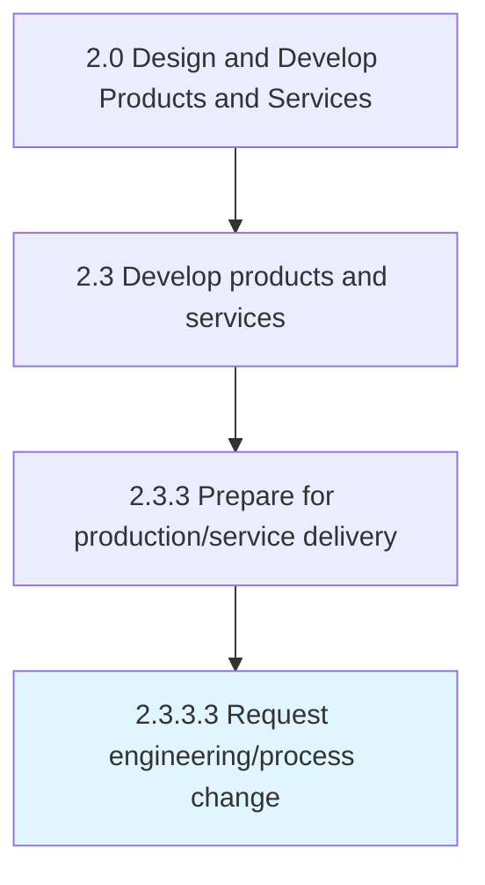

# Request engineering/process change

> Requesting changes in the production and/or delivery operations for processing the new or revised products/services.

## Overview

Activity 2.3.3.3 is an activity within the Design and Develop Products and Services framework. 

Requesting changes in the production and/or delivery operations for processing the new or revised products/services. Rectify any problems identified in the manufacturing or delivery processes (through Monitor production runs [11417]). Seek changes in components, repair machinery, optimize production lines, and tweak factory assemblies through a formal notice to the concerned division, known as an engineering change order.

## Process Hierarchy



## Key Statistics

| Metric | Value |
|--------|-------|
| APQC Code | 11418 |
| Hierarchy ID | 2.3.3.3 |
| Level | Activity |
| Parent | [2.3.3](../) |
| Sub-Processes | 0 |


## GraphDL Semantic Structure

```
request.EngineeringprocessChange
```

| Component | Value | Description |
|-----------|-------|-------------|
| Verb | `request` | Primary action |
| Object | `engineering/process change` | Direct object |


## Related Concepts

- EngineeringChange
- ProcessChange


---

*Source: APQC PCF 11418 (2.3.3.3) - APQC*
