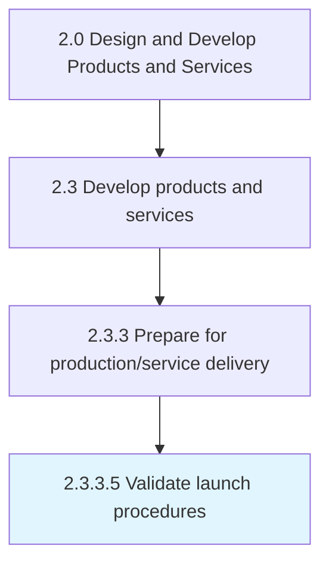

# Validate launch procedures

> Verifying the measures/processes/techniques through systems and tools involved in the introduction of products and services.

## Overview

Activity 2.3.3.5 is an activity within the Design and Develop Products and Services framework. 

Verifying the measures/processes/techniques through systems and tools involved in the introduction of products and services.

## Process Hierarchy



## Key Statistics

| Metric | Value |
|--------|-------|
| APQC Code | 19998 |
| Hierarchy ID | 2.3.3.5 |
| Level | Activity |
| Parent | [2.3.3](../) |
| Sub-Processes | 0 |


## GraphDL Semantic Structure

```
validate.LaunchProcedures
```

| Component | Value | Description |
|-----------|-------|-------------|
| Verb | `validate` | Primary action |
| Object | `launch procedures` | Direct object |


## Related Concepts

- [LaunchProcedures](/concepts/LaunchProcedures)


---

*Source: APQC PCF 19998 (2.3.3.5) - APQC*
