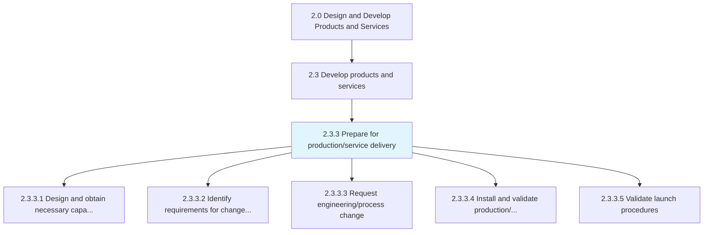
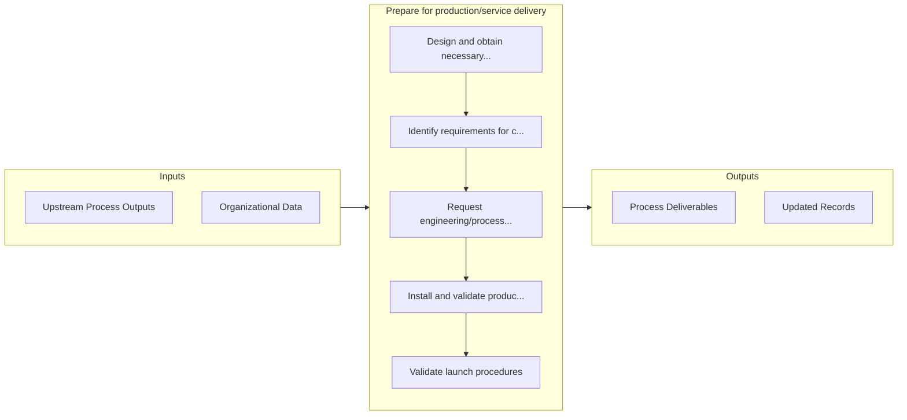

# Prepare for production/service delivery

> Devising business plans and procedures for manufacturing/operations/production and delivery of services offered by the organization.

## Overview

Process 2.3.3 is a core process that defines the specific procedures for prepare for production/service delivery. 

Devising business plans and procedures for manufacturing/operations/production and delivery of services offered by the organization. Further in general terms the total amount of output that the manufacturing department is responsible to produce for each period.

## Process Hierarchy



## Key Statistics

| Metric | Value |
|--------|-------|
| APQC Code | 19997 |
| Hierarchy ID | 2.3.3 |
| Level | Process |
| Parent | [2.3](../) |
| Sub-Processes | 5 |


## GraphDL Semantic Structure

```graphdl
prepare.ForProductionserviceDelivery
```

| Component | Value | Description |
|-----------|-------|-------------|
| Verb | `prepare` | Primary action |
| Object | `for production/service delivery` | Direct object |


## Process Flow



## Sub-Processes

| Process | Hierarchy ID | Description |
|---------|-------------|-------------|
| [Design and obtain necessary capabilities/materials and equipment](./DesignAndObtainNecessaryCapabilitiesmaterialsAndEquipment) | 2.3.3.1 | Developing and/or sourcing the essential machinery needed for creating purpose-built processes, as w |
| [Identify requirements for changes to manufacturing/delivery processes](./IdentifyRequirementsForChangesToManufacturingdeliveryProcesses) | 2.3.3.2 | Identifying any changes that need to be effectuated in the organization's internal processes for man |
| [Request engineering/process change](./RequestEngineeringprocessChange) | 2.3.3.3 | Requesting changes in the production and/or delivery operations for processing the new or revised pr |
| [Install and validate production/service delivery process](./2.3.3.4-InstallValidateProductionserviceDelivery/) | 2.3.3.4 | Finalizing production process or methodology |
| [Validate launch procedures](./ValidateLaunchProcedures) | 2.3.3.5 | Verifying the measures/processes/techniques through systems and tools involved in the introduction o |


## Related Concepts

- ProductionDelivery
- ServiceDelivery


---

*Source: APQC PCF 19997 (2.3.3) - APQC*
