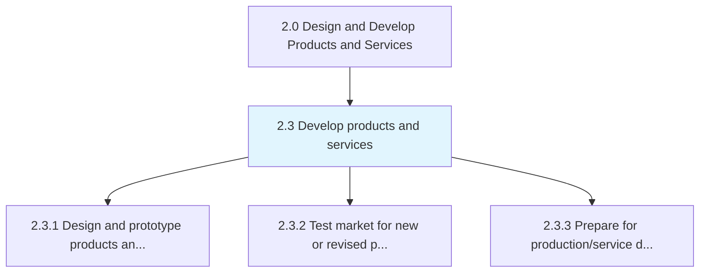
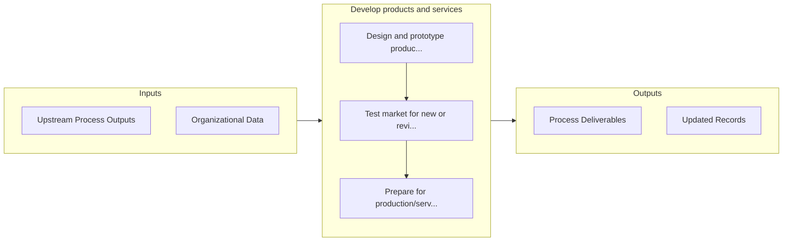

# Develop products and services

> Developing new products/services from scratch, including all activities associated with the design, prototyping, evaluation, and market testing of these planned offerings.

## Overview

Group 2.3 is a process group within APQC Category 2.0 (Design and Develop Products and Services). 

Developing new products/services from scratch, including all activities associated with the design, prototyping, evaluation, and market testing of these planned offerings.

## Process Hierarchy



## Key Statistics

| Metric | Value |
|--------|-------|
| APQC Code | 10062 |
| Hierarchy ID | 2.3 |
| Level | Group |
| Parent | [2](../) |
| Sub-Processes | 3 |


## GraphDL Semantic Structure

```graphdl
develop.ProductsAndServices
```

| Component | Value | Description |
|-----------|-------|-------------|
| Verb | `develop` | Primary action |
| Object | `products and services` | Direct object |


## Process Flow



## Sub-Processes

| Process | Hierarchy ID | Description |
|---------|-------------|-------------|
| [Design and prototype products and services](./2.3.1-DesignPrototypeProductsServices/) | 2.3.1 | Sketching and standardizing product and service based on the market |
| [Test market for new or revised products and services](./2.3.2-TestMarketNewRevised/) | 2.3.2 | Expanding on the marketplace analysis that took place earlier in the product development lifecycle b |
| [Prepare for production/service delivery](./2.3.3-PrepareProductionserviceDelivery/) | 2.3.3 | Devising business plans and procedures for manufacturing/operations/production and delivery of servi |


## Related Concepts

- Products
- Services


---

*Source: APQC PCF 10062 (2.3) - APQC*
