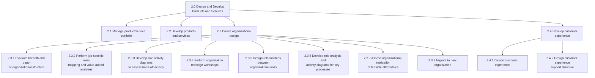
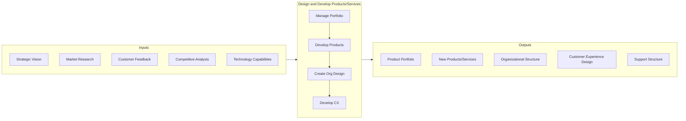
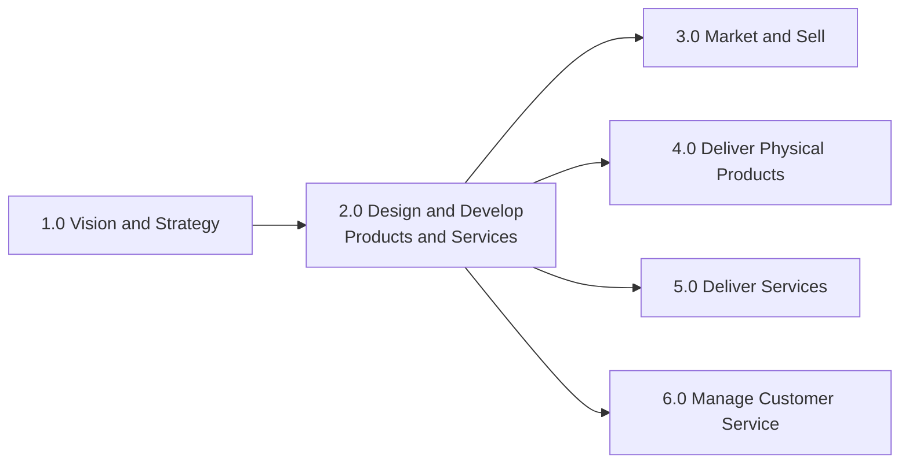

# Design and Develop Products and Services

> Designing, developing, and managing the products and services that an organization offers to its customers. This involves understanding customer needs, creating organizational designs to support product/service delivery, and continuously improving the customer experience.

## Overview

APQC Category 2.0 - Design and Develop Products and Services is a critical operating process category that encompasses all activities related to creating and refining the products and services an organization delivers to its customers. This category bridges strategic vision (Category 1.0) with operational execution (Categories 3.0-6.0) by translating market needs into deliverable offerings.

Organizations use these processes to ensure their products and services meet customer expectations, align with brand values, and can be efficiently delivered through well-designed organizational structures. The processes within this category span from organizational design to customer experience optimization.

## Process Hierarchy



## Key Statistics

| Metric | Value |
|--------|-------|
| APQC Code | 10003 |
| Hierarchy ID | 2.0 |
| Level | Category |
| Process Groups | 4 |
| Total Processes | 50+ |

## GraphDL Semantic Structure

```graphdl
design.ProductsAndServices
develop.ProductsAndServices
```

| Component | Value | Description |
|-----------|-------|-------------|
| Verb | `design`, `develop` | Primary actions of creating and refining |
| Object | `ProductsAndServices` | The offerings delivered to customers |
| Preposition | - | Not applicable at category level |
| PrepObject | - | Not applicable at category level |

## Processes in this Category

### 2.1 Manage product/service portfolio

Managing the collection of products and services offered by the organization, including lifecycle management and portfolio optimization.

### 2.2 Develop products and services

Creating new products and services through research, design, prototyping, and testing processes.

### 2.3 Create organizational design

Formulating a design for the organization's resources that allows it to meet its objectives.

- [Create organizational design](./OrgDesign.mdx) - Process 2.3
- [Perform organization redesign workshops](./RedesignWorkshops.mdx) - Activity 2.3.4
- [Design relationships between organizational units](./UnitRelationships.mdx) - Activity 2.3.5

### 2.4 Develop customer experience

Defining a roadmap to meet customer expectations while considering business impact.

- [Design customer experience](./CustomerExperience.mdx) - Process 2.4.1
- [Design customer experience support structure](./SupportStructure.mdx) - Process 2.4.2

## Process Flow



## RACI Matrix

| Activity | Responsible | Accountable | Consulted | Informed |
|----------|-------------|-------------|-----------|----------|
| Manage product portfolio | Product Management | CPO | Marketing, Sales | Executive Team |
| Develop products/services | R&D, Engineering | CTO | Marketing, Operations | All Departments |
| Create organizational design | HR, Strategy | COO | All Departments | All Employees |
| Develop customer experience | CX Team | CMO | Sales, Support | All Departments |

## Related Departments

- [Product Management](/departments/Product) - Portfolio and product development
- [Research & Development](/departments/Research) - Innovation and development
- [Human Resources](/departments/HR/index) - Organizational design
- [Customer Experience](/departments/Support) - Experience design
- [Marketing](/departments/Marketing/index) - Market insights and brand alignment

## Related Occupations

- [Product Managers](/occupations/ProductManagers) - Portfolio and product leadership
- [UX Designers](/occupations/UXDesigners) - Experience design
- [Organizational Development Specialists](/occupations/OrgDevelopment) - Organizational design
- [Business Analysts](/occupations/BusinessAnalysts) - Process analysis
- [Customer Experience Managers](/occupations/CXManagers) - Customer journey optimization

## Industry Variations

### Banking

Banking focuses on digital product development, regulatory compliance, and omnichannel customer experience. Organizational design emphasizes risk management and compliance functions.

**Industry-Specific Activities:**
- Develop digital banking products
- Design regulatory-compliant processes
- Create omnichannel customer journeys

### Healthcare Provider

Healthcare organizations design products and services around patient outcomes, care pathways, and value-based care models.

**Industry-Specific Activities:**
- Design care delivery services
- Develop patient experience programs
- Create clinical organizational structures

### Retail

Retail emphasizes product merchandising, customer experience across channels, and agile organizational structures to respond to market trends.

**Industry-Specific Activities:**
- Manage product assortment and merchandising
- Design omnichannel shopping experiences
- Create customer-centric organizational models

## Related Categories



## Metrics & KPIs

| Metric | Description | Target |
|--------|-------------|--------|
| Product Development Cycle Time | Time from concept to launch | Industry benchmark |
| Customer Satisfaction Score | Overall customer satisfaction | >85% |
| Organizational Efficiency | Process efficiency measures | >90% |
| Experience Design Effectiveness | CX improvement metrics | >15% YoY |
| Portfolio Health Score | Balance and performance of portfolio | Top quartile |

---

*Source: APQC PCF Category 2.0 - Cross-Industry*
