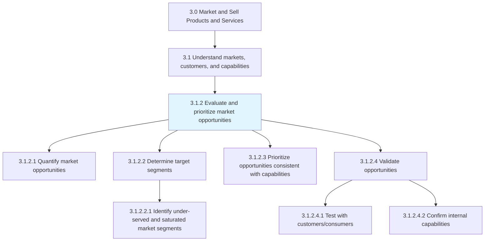
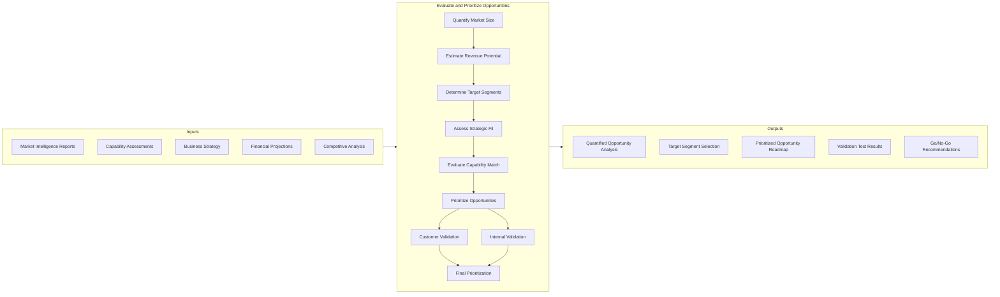
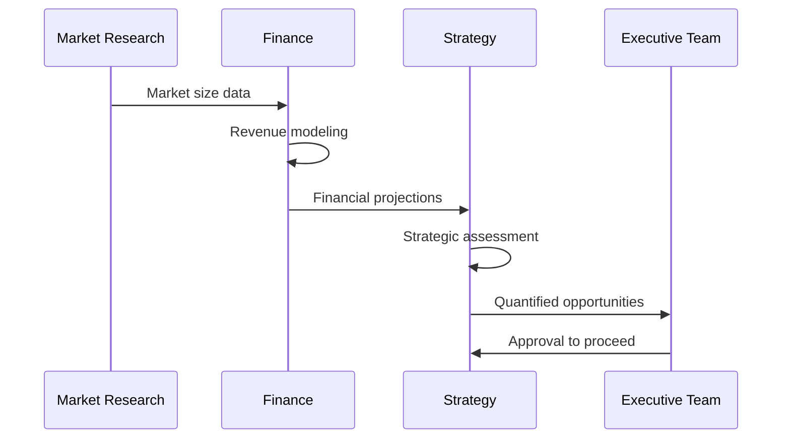
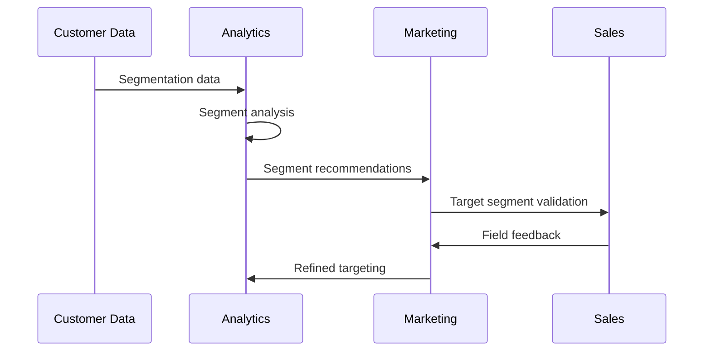
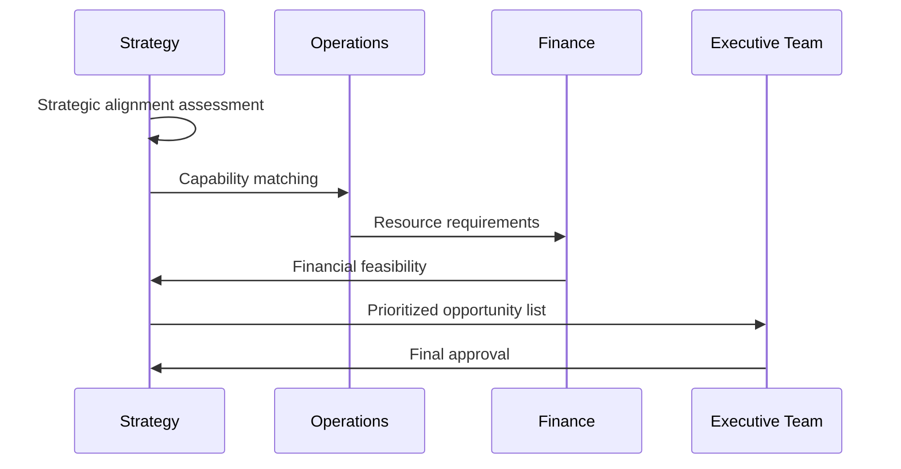
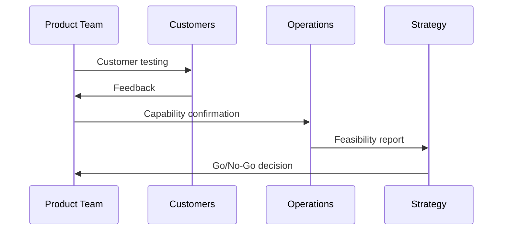
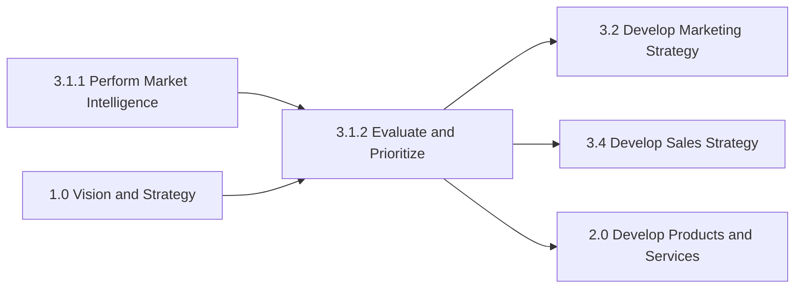

# Evaluate and Prioritize Market Opportunities

> Appraising market opportunities by quantifying and subjecting them to prioritization, as well as validation tests. Closely examine the market opportunities that have been identified by Perform customer and market intelligence analysis. Triangulate those opportunities to capitalize by finding a fit between identified opportunities and the composite of organizational capabilities and business strategy.

## Overview

Evaluate and Prioritize Market Opportunities is the strategic decision-making process that transforms market intelligence into actionable business priorities. This process ensures that organizations focus their resources on the most promising opportunities that align with their capabilities and strategic objectives.

The process involves rigorous quantification of market potential, systematic prioritization frameworks, and validation testing to confirm opportunity viability. Effective execution reduces resource waste, accelerates time-to-market, and improves success rates for new market entries.

## Process Hierarchy



## Key Statistics

| Metric | Value |
|--------|-------|
| APQC Code | 10107 |
| Hierarchy ID | 3.1.2 |
| Level | Process |
| Parent Group | [3.1 Understand markets, customers, and capabilities](../index.mdx) |
| Category | [3.0 Market and Sell Products and Services](../../index.mdx) |
| Child Activities | 4 |
| Metrics Available | Yes |

## GraphDL Semantic Structure

```
evaluate.MarketOpportunities.and.Prioritize
```

| Component | Value | Description |
|-----------|-------|-------------|
| Verb | `evaluate` | Primary action of assessing and appraising |
| Object | `MarketOpportunities` | Potential business opportunities in the market |
| Preposition | `and` | Conjunction linking evaluation to prioritization |
| PrepObject | `Prioritize` | Secondary action of ranking and ordering |

### Decomposed Actions

| GraphDL Action | Description |
|----------------|-------------|
| `quantify.MarketOpportunities` | Attach measurable indicators to opportunities |
| `determine.TargetSegments` | Identify specific customer segments to pursue |
| `prioritize.Opportunities` | Rank opportunities by strategic fit |
| `validate.Opportunities` | Confirm practicability and feasibility |
| `test.WithCustomers` | Validate with actual customer feedback |

## Process Flow



## Activities

### 3.1.2.1 - Quantify market opportunities

Attaching quantifiable indicators to opportunities that have been identified in the market. Compute estimated figures of the approximate value that can be captured with the provision of existing products/services.



**Key Actions:**
- `calculate.TotalAddressableMarket` - Determine full market potential
- `estimate.ServiceableMarket` - Define reachable market portion
- `project.RevenueOpportunity` - Forecast potential revenue
- `assess.MarketGrowthRate` - Evaluate market trajectory

### 3.1.2.2 - Determine target segments

Identifying the targeted segment of customers. Deduce those particular customer segments that are to be targeted from among the market segments.



**Tasks:**
- [Identify under-served and saturated market segments](./DetermineTargetSegments/IdentifyMarketSegmentStatus.mdx)

**Key Actions:**
- `identify.UnderservedSegments` - Find unmet customer needs
- `analyze.SegmentAttractiveness` - Evaluate segment potential
- `select.TargetSegments` - Choose segments to pursue

### 3.1.2.3 - Prioritize opportunities consistent with capabilities and overall business strategy

Creating an index of market opportunities and arranging them in order of preference. Prioritize based on the opportunities' adherence to the overall business strategy. Correlate with the competencies and capacities that the organization possesses.



**Key Actions:**
- `assess.StrategicAlignment` - Evaluate strategy fit
- `match.Capabilities` - Align with organizational abilities
- `rank.Opportunities` - Order by priority score
- `allocate.Resources` - Plan resource distribution

### 3.1.2.4 - Validate opportunities

Confirming the practicability and reasonableness of the market opportunities that have been identified. Give substance to the real-time feasibility of the market opportunities.



**Tasks:**
- [Test with customers/consumers](./ValidateOpportunities/TestWithCustomers.mdx)
- [Confirm internal capabilities](./ValidateOpportunities/ConfirmInternalCapabilities.mdx)

**Key Actions:**
- `test.CustomerAcceptance` - Validate with target customers
- `confirm.OperationalCapability` - Verify execution ability
- `validate.FinancialViability` - Confirm financial feasibility

## RACI Matrix

| Activity | Responsible | Accountable | Consulted | Informed |
|----------|-------------|-------------|-----------|----------|
| Quantify opportunities | Business Development | CFO | Marketing, Finance | Executive Team |
| Determine target segments | Marketing Analytics | CMO | Sales, Product | Operations |
| Prioritize opportunities | Strategy Team | CEO | All Functions | Board |
| Test with customers | Product Team | VP Product | Marketing, Sales | Strategy |
| Confirm capabilities | Operations | COO | Finance, IT | Executive Team |

## Related Departments

- [Strategy](/departments/Strategy/index) - Strategic prioritization oversight
- [Marketing](/departments/Marketing/index) - Segment analysis and targeting
- [Finance](/departments/Finance/index) - Financial modeling and validation
- [Operations](/departments/Operations/index) - Capability assessment
- [Product Management](/departments/Product) - Customer validation

## Related Occupations

- [Strategic Planners](/occupations/StrategicPlanners) - Opportunity prioritization
- [Business Development Managers](/occupations/BusinessDevelopmentManagers) - Opportunity quantification
- [Marketing Managers](/occupations/Management/MarketingManagers) - Segment targeting
- [Financial Analysts](/occupations/Business/Financial/FinancialAnalysts) - Financial modeling
- [Product Managers](/occupations/ProductManagers) - Customer validation

## Industry Variations

### Consumer Products

Emphasis on retailer validation, trade feasibility, and consumer testing through panels.

**Industry-Specific Activities:**
- Retailer acceptance testing
- Consumer panel validation
- Trade margin analysis
- Shelf space feasibility

### Banking

Focus on regulatory compliance validation, risk assessment, and capital requirements.

**Industry-Specific Activities:**
- Regulatory compliance review
- Capital requirement analysis
- Risk-adjusted return calculation
- Compliance validation testing

### Retail

Emphasis on store-level feasibility, real estate requirements, and omnichannel validation.

**Industry-Specific Activities:**
- Store format validation
- Location feasibility analysis
- E-commerce capability assessment
- Omnichannel readiness evaluation

### Healthcare Provider

Focus on clinical capability validation, regulatory compliance, and payer acceptance.

**Industry-Specific Activities:**
- Clinical capability assessment
- Regulatory compliance validation
- Payer contract feasibility
- Physician acceptance testing

## Metrics & KPIs

| Metric | Description | Target |
|--------|-------------|--------|
| Opportunity Conversion Rate | Prioritized opportunities that succeed | >40% |
| Validation Accuracy | Validated opportunities that perform as expected | >75% |
| Time to Validation | Days from opportunity identification to validation | <45 days |
| Resource Efficiency | Resources allocated to successful opportunities | >60% |
| Strategic Alignment Score | Opportunities aligned with strategy | >80% |
| Customer Validation Rate | Opportunities validated by customers | >70% |

## Related Processes



---

*Source: APQC PCF 10107 (3.1.2) - Cross-Industry*
