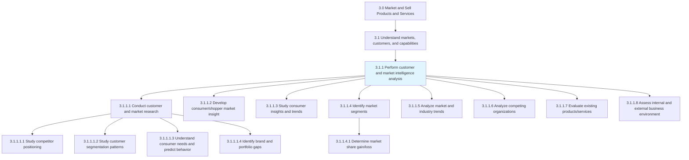
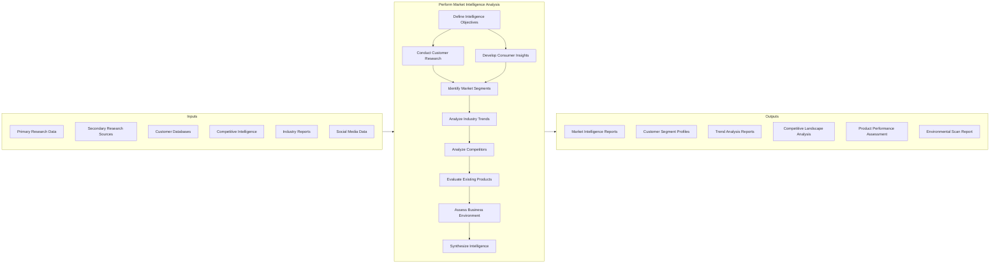
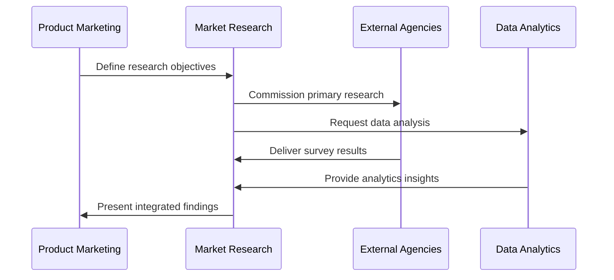
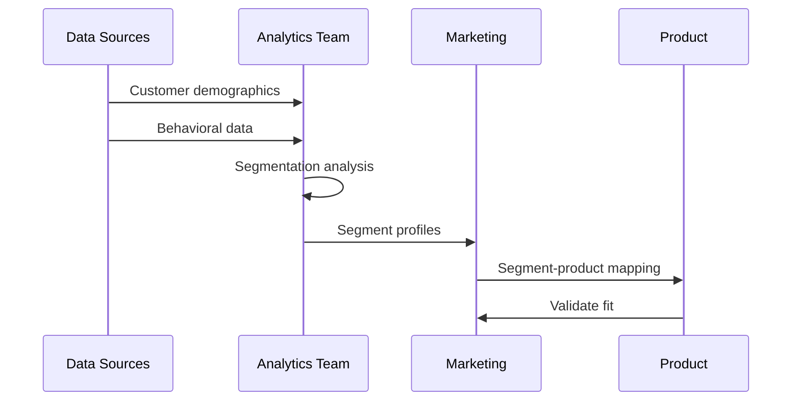
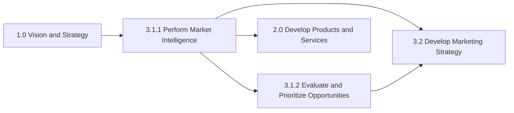

# Perform Customer and Market Intelligence Analysis

> Gathering intelligence on the market and customers. Closely examine the inherent attributes and collective behavior of the various market and customer segments. Track trends in the market. Determine what drives the customers to make purchasing decisions in order to identify opportunities in the market.

## Overview

Perform Customer and Market Intelligence Analysis is a critical process that forms the analytical foundation for all marketing and sales activities. This process systematically gathers, analyzes, and synthesizes information about markets, customers, competitors, and industry trends to support strategic decision-making.

The process encompasses both primary research (surveys, interviews, focus groups) and secondary research (industry reports, data analysis) to build a comprehensive understanding of the market landscape. Effective execution of this process enables organizations to identify emerging opportunities, anticipate competitive threats, and align offerings with customer needs.

## Process Hierarchy



## Key Statistics

| Metric | Value |
|--------|-------|
| APQC Code | 10106 |
| Hierarchy ID | 3.1.1 |
| Level | Process |
| Parent Group | [3.1 Understand markets, customers, and capabilities](../index.mdx) |
| Category | [3.0 Market and Sell Products and Services](../../index.mdx) |
| Child Activities | 8 |
| Metrics Available | Yes |

## GraphDL Semantic Structure

```graphdl
perform.CustomerAndMarketIntelligenceAnalysis
```

| Component | Value | Description |
|-----------|-------|-------------|
| Verb | `perform` | Primary action of executing analysis |
| Object | `CustomerAndMarketIntelligenceAnalysis` | Comprehensive intelligence gathering and analysis |
| Preposition | - | No secondary preposition |
| PrepObject | - | No secondary object |

### Decomposed Actions

| GraphDL Action | Description |
|----------------|-------------|
| `gather.MarketIntelligence` | Collect market data from various sources |
| `analyze.CustomerBehavior` | Examine customer purchasing patterns |
| `track.MarketTrends` | Monitor industry and market movements |
| `identify.PurchaseDrivers` | Determine factors influencing buying decisions |
| `assess.MarketOpportunities` | Evaluate potential market opportunities |

## Process Flow



## Activities

### 3.1.1.1 - Conduct customer and market research

Conducting primary and secondary research to understand customer needs, market dynamics, and competitive positioning.



**Tasks:**
- [Study competitor category and brand positioning](./ConductCustomerMarketResearch/StudyCompetitorPositioning.mdx)
- [Study customer segmentation patterns](./ConductCustomerMarketResearch/StudySegmentationPatterns.mdx)
- [Understand consumer needs and predict purchasing behavior](./ConductCustomerMarketResearch/UnderstandConsumerNeeds.mdx)
- [Identify brand and portfolio gaps](./ConductCustomerMarketResearch/IdentifyBrandGaps.mdx)

### 3.1.1.2 - Develop consumer/shopper market insight and identify trends

Developing deep understanding of consumer behavior and shopping patterns to identify emerging trends.

**Key Actions:**
- `analyze.ShopperBehavior` - Examine how consumers shop
- `identify.EmergingTrends` - Spot market pattern shifts
- `develop.ConsumerProfiles` - Create detailed buyer personas

### 3.1.1.3 - Study consumer insights and trends

Analyzing consumer insights to understand motivations, preferences, and evolving needs.

**Key Actions:**
- `study.ConsumerMotivations` - Understand why customers buy
- `track.PreferenceChanges` - Monitor shifting preferences
- `forecast.ConsumerTrends` - Predict future behavior

### 3.1.1.4 - Identify market segments

Identifying sections of the customer population to target for marketing products/services. Create segments within the customer population for targeted marketing campaigns.



**Tasks:**
- [Determine market share gain/loss](./IdentifyMarketSegments/DetermineMarketShare.mdx)

### 3.1.1.5 - Analyze market and industry trends

Examining large-scale shifts and trends with relevance to the organization's products/services.

**Key Actions:**
- `analyze.IndustryDynamics` - Assess industry structure changes
- `track.MarketMovements` - Monitor market size and growth
- `evaluate.InnovationActivity` - Assess technology/product innovation

### 3.1.1.6 - Analyze competing organizations, competitive/substitute products/services

Examining the strengths and weaknesses of competing organizations and their offerings.

**Key Actions:**
- `assess.CompetitorStrategies` - Evaluate competitor approaches
- `analyze.CompetitiveProducts` - Examine competing offerings
- `benchmark.Capabilities` - Compare organizational capabilities

### 3.1.1.7 - Evaluate existing products/services

Examining the brands owned and products offered in the market. Determine the relative position of existing products/brands in the marketplace.

**Key Actions:**
- `evaluate.ProductPerformance` - Assess product market position
- `analyze.BrandHealth` - Measure brand perception
- `identify.PortfolioGaps` - Find product line gaps

### 3.1.1.8 - Assess internal and external business environment

Understanding the culture and environment in which you're operating. Analyze internal capabilities and external market factors.

**Key Actions:**
- `assess.InternalCapabilities` - Evaluate organizational strengths
- `scan.ExternalEnvironment` - Monitor market conditions
- `identify.EnvironmentalFactors` - Recognize key influences

## RACI Matrix

| Activity | Responsible | Accountable | Consulted | Informed |
|----------|-------------|-------------|-----------|----------|
| Conduct customer research | Market Research Team | CMO | Sales, Product | Strategy |
| Develop consumer insights | Consumer Insights Team | VP Marketing | Brand Teams | All |
| Study consumer trends | Trend Analysts | Market Research Director | Product | Marketing |
| Identify market segments | Analytics Team | VP Marketing | Sales | Operations |
| Analyze industry trends | Strategy Team | CSO | Executive Team | All |
| Analyze competitors | Competitive Intelligence | VP Strategy | Product, Sales | Executive |
| Evaluate products | Product Marketing | VP Product | Sales, Finance | Operations |
| Assess business environment | Strategy Team | CEO | All Functions | Board |

## Related Departments

- [Marketing](/departments/Marketing/index) - Primary ownership of market intelligence
- [Sales](/departments/Sales/index) - Field intelligence and customer feedback
- [Product Management](/departments/Product) - Product-market analysis
- [Strategy](/departments/Strategy/index) - Strategic intelligence integration
- Business Development - Opportunity identification

## Related Occupations

- [Market Research Analysts](/occupations/MarketResearchAnalysts) - Primary research execution
- [Business Intelligence Analysts](/occupations/Technology/BusinessIntelligenceAnalysts) - Data analysis
- [Competitive Intelligence Analysts](/occupations/CompetitiveIntelligenceAnalysts) - Competitor monitoring
- [Marketing Managers](/occupations/Management/MarketingManagers) - Research direction
- [Data Scientists](/occupations/Technology/DataScientists) - Advanced analytics

## Industry Variations

### Consumer Products

Heavy emphasis on shopper insights, retailer data integration, and category management analytics.

**Industry-Specific Activities:**
- Point-of-sale data analysis
- Consumer panel studies
- Category performance tracking
- Trade promotion analysis

### Banking

Focus on customer financial behavior analysis, regulatory landscape monitoring, and digital banking adoption.

**Industry-Specific Activities:**
- Customer financial lifecycle analysis
- Product profitability analysis
- Channel usage studies
- Regulatory impact assessment

### Retail

Emphasis on store-level analytics, e-commerce behavior, and omnichannel customer journey mapping.

**Industry-Specific Activities:**
- Store performance analysis
- E-commerce conversion tracking
- Customer journey mapping
- Location-based analytics

### Healthcare Provider

Focus on patient demographics, clinical needs, and healthcare market dynamics.

**Industry-Specific Activities:**
- Patient population analysis
- Service line demand forecasting
- Referral pattern analysis
- Payer mix analysis

## Metrics & KPIs

| Metric | Description | Target |
|--------|-------------|--------|
| Research Cycle Time | Days from initiation to insight delivery | <21 days |
| Intelligence Coverage | Percentage of market monitored | >85% |
| Competitor Coverage | Key competitors tracked vs. total | >95% |
| Insight Accuracy | Predictions validated by outcomes | >80% |
| Research Utilization | Insights used in decisions | >75% |
| Customer Coverage | Segments researched vs. total | >90% |

## Related Processes



---

*Source: APQC PCF 10106 (3.1.1) - Cross-Industry*
