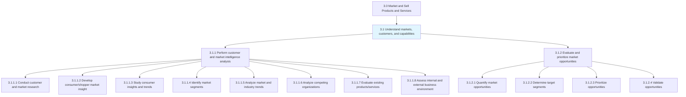
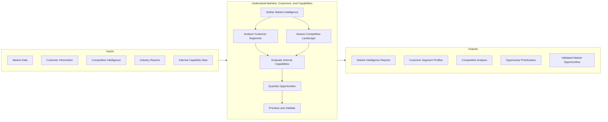
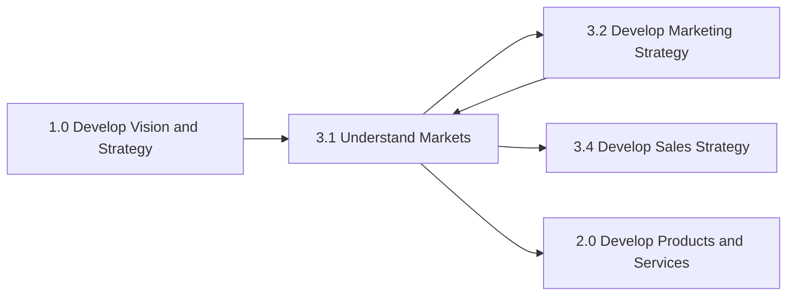

# Understand Markets, Customers, and Capabilities

> Making sense of the market and customers to identify the right opportunities to be capitalized, given the organization's competencies. Discern trends and shifts in the market and customers. Identify the right market opportunities that fit closely with the organization's capabilities and strategy by gathering intelligence on various attributes of different market/customer segments.

## Overview

Understand Markets, Customers, and Capabilities is the foundational process group within the Market and Sell Products and Services category. This process group ensures that organizations have deep insight into their market environment before developing strategies or executing plans.

The processes in this group focus on intelligence gathering, analysis, and opportunity prioritization. Organizations use both primary and secondary research methods, competitive analysis, and internal capability assessments to build a comprehensive view of where to compete and how to win.

## Process Hierarchy



## Key Statistics

| Metric | Value |
|--------|-------|
| APQC Code | 10101 |
| Hierarchy ID | 3.1 |
| Level | Process Group |
| Parent Category | [3.0 Market and Sell Products and Services](../index.mdx) |
| Child Processes | 2 |
| Total Activities | 12+ |
| Metrics Available | Yes |

## GraphDL Semantic Structure

```graphdl
understand.Markets.and.CustomersAndCapabilities
```

| Component | Value | Description |
|-----------|-------|-------------|
| Verb | `understand` | Primary action of comprehending and analyzing |
| Object | `Markets` | Market landscapes being studied |
| Preposition | `and` | Conjunction linking related concepts |
| PrepObject | `CustomersAndCapabilities` | Customer needs and organizational abilities |

## Processes

### 3.1.1 - Perform customer and market intelligence analysis

Gathering intelligence on the market and customers. Closely examine the inherent attributes and collective behavior of the various market and customer segments. Track trends in the market. Determine what drives the customers to make purchasing decisions in order to identify opportunities in the market.

**Activities:**
- [Conduct customer and market research](./PerformMarketIntelligence/ConductCustomerMarketResearch.mdx)
- [Develop consumer/shopper market insight and identify trends](./PerformMarketIntelligence/DevelopConsumerInsight.mdx)
- [Study consumer insights and trends](./PerformMarketIntelligence/StudyConsumerInsights.mdx)
- [Identify market segments](./PerformMarketIntelligence/IdentifyMarketSegments.mdx)
- [Analyze market and industry trends](./PerformMarketIntelligence/AnalyzeMarketTrends.mdx)
- [Analyze competing organizations](./PerformMarketIntelligence/AnalyzeCompetitors.mdx)
- [Evaluate existing products/services](./PerformMarketIntelligence/EvaluateExistingProducts.mdx)
- [Assess internal and external business environment](./PerformMarketIntelligence/AssessBusinessEnvironment.mdx)

### 3.1.2 - Evaluate and prioritize market opportunities

Appraising market opportunities by quantifying and subjecting them to prioritization, as well as validation tests. Closely examine the market opportunities that have been identified by market intelligence analysis. Triangulate those opportunities to capitalize by finding a fit between identified opportunities and the composite of organizational capabilities and business strategy.

**Activities:**
- [Quantify market opportunities](./EvaluatePrioritizeOpportunities/QuantifyOpportunities.mdx)
- [Determine target segments](./EvaluatePrioritizeOpportunities/DetermineTargetSegments.mdx)
- [Prioritize opportunities consistent with capabilities and strategy](./EvaluatePrioritizeOpportunities/PrioritizeOpportunities.mdx)
- [Validate opportunities](./EvaluatePrioritizeOpportunities/ValidateOpportunities.mdx)

## Process Flow



## RACI Matrix

| Activity | Responsible | Accountable | Consulted | Informed |
|----------|-------------|-------------|-----------|----------|
| Conduct market research | Market Research Team | CMO | Sales, Product | Executive Team |
| Analyze customer segments | Market Research Analysts | VP Marketing | Customer Success | Sales |
| Competitive analysis | Competitive Intelligence | VP Strategy | Product Management | All |
| Capability assessment | Strategy Team | CEO | Operations | Marketing |
| Quantify opportunities | Business Development | CFO | Finance | Board |
| Prioritize opportunities | Executive Team | CEO | All Functions | Investors |

## Related Departments

- [Marketing](/departments/Marketing/index) - Primary ownership of market research
- [Sales](/departments/Sales/index) - Customer insights and market feedback
- [Strategy](/departments/Strategy/index) - Capability assessment and prioritization
- Business Development - Opportunity identification
- [Product Management](/departments/Product) - Product-market fit analysis

## Related Occupations

- [Market Research Analysts](/occupations/MarketResearchAnalysts) - Primary research execution
- [Marketing Managers](/occupations/Management/MarketingManagers) - Research oversight
- [Business Intelligence Analysts](/occupations/Technology/BusinessIntelligenceAnalysts) - Data analysis
- [Competitive Intelligence Analysts](/occupations/CompetitiveIntelligenceAnalysts) - Competitor monitoring
- [Strategic Planners](/occupations/StrategicPlanners) - Opportunity prioritization

## Industry Variations

### Consumer Products

Emphasis on shopper insights, category management, and retail channel intelligence. Heavy use of point-of-sale data and consumer panels.

**Industry-Specific Focus:**
- Shopper behavior analysis
- Category performance tracking
- Retailer relationship insights
- Consumer trend forecasting

### Banking

Focus on customer financial behavior, regulatory landscape analysis, and digital banking adoption patterns.

**Industry-Specific Focus:**
- Customer financial lifecycle analysis
- Regulatory impact assessment
- Digital adoption tracking
- Risk-adjusted opportunity evaluation

### Retail

Emphasis on omnichannel customer behavior, store-level performance, and location-based market analysis.

**Industry-Specific Focus:**
- Store catchment analysis
- E-commerce behavior tracking
- Competitive store monitoring
- Price elasticity studies

### Healthcare Provider

Focus on patient demographics, clinical needs assessment, and healthcare market dynamics within regulatory constraints.

**Industry-Specific Focus:**
- Patient population analysis
- Service line demand forecasting
- Referral pattern analysis
- Community health needs assessment

## Metrics & KPIs

| Metric | Description | Target |
|--------|-------------|--------|
| Market Coverage | Percentage of addressable market analyzed | >80% |
| Insight Accuracy | Predictions validated by actual outcomes | >75% |
| Time to Insight | Days from research initiation to delivery | <30 days |
| Competitive Coverage | Competitors monitored vs. total relevant | >90% |
| Opportunity Conversion | Prioritized opportunities that succeed | >40% |
| Research Utilization | Insights that inform actual decisions | >70% |

## Related Processes



---

*Source: APQC PCF 10101 (3.1) - Cross-Industry*
