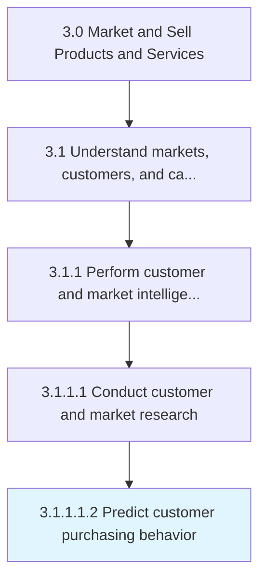

# Predict customer purchasing behavior

> Using customer segmentation tools to examine past customer behavior to predict future purchasing patterns.

## Overview

Sub-Activity 3.1.1.1.2 is an activity within the Market and Sell Products and Services framework. 

Using customer segmentation tools to examine past customer behavior to predict future purchasing patterns.

## Process Hierarchy



## Key Statistics

| Metric | Value |
|--------|-------|
| APQC Code | 21424 |
| Hierarchy ID | 3.1.1.1.2 |
| Level | Sub-Activity |
| Parent | [3.1.1.1](../) |
| Sub-Processes | 0 |


## GraphDL Semantic Structure

```
predict.CustomerPurchasingBehavior
```

| Component | Value | Description |
|-----------|-------|-------------|
| Verb | `predict` | Primary action |
| Object | `customer purchasing behavior` | Direct object |


## Related Concepts

- [CustomerPurchasingBehavior](/concepts/CustomerPurchasingBehavior)


---

*Source: APQC PCF 21424 (3.1.1.1.2) - APQC*
