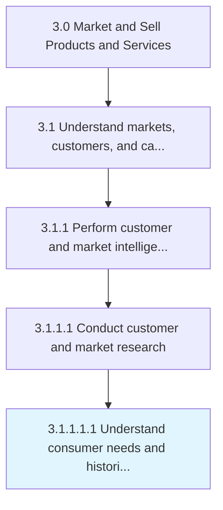

# Understand consumer needs and historical behaviors

> Identifying the factors that drive the targeted market segment.

## Overview

Sub-Activity 3.1.1.1.1 is an activity within the Market and Sell Products and Services framework. 

Identifying the factors that drive the targeted market segment. Model customer purchasing patterns, and forecast their future purchasing behavior.

## Process Hierarchy



## Key Statistics

| Metric | Value |
|--------|-------|
| APQC Code | 10114 |
| Hierarchy ID | 3.1.1.1.1 |
| Level | Sub-Activity |
| Parent | [3.1.1.1](../) |
| Sub-Processes | 0 |


## GraphDL Semantic Structure

```
understand.ConsumerNeedsAndHistoricalBehaviors
```

| Component | Value | Description |
|-----------|-------|-------------|
| Verb | `understand` | Primary action |
| Object | `consumer needs and historical behaviors` | Direct object |


## Related Concepts

- [ConsumerNeedsBehaviors](/concepts/ConsumerNeedsBehaviors)
- [HistoricalBehaviors](/concepts/HistoricalBehaviors)


---

*Source: APQC PCF 10114 (3.1.1.1.1) - APQC*
