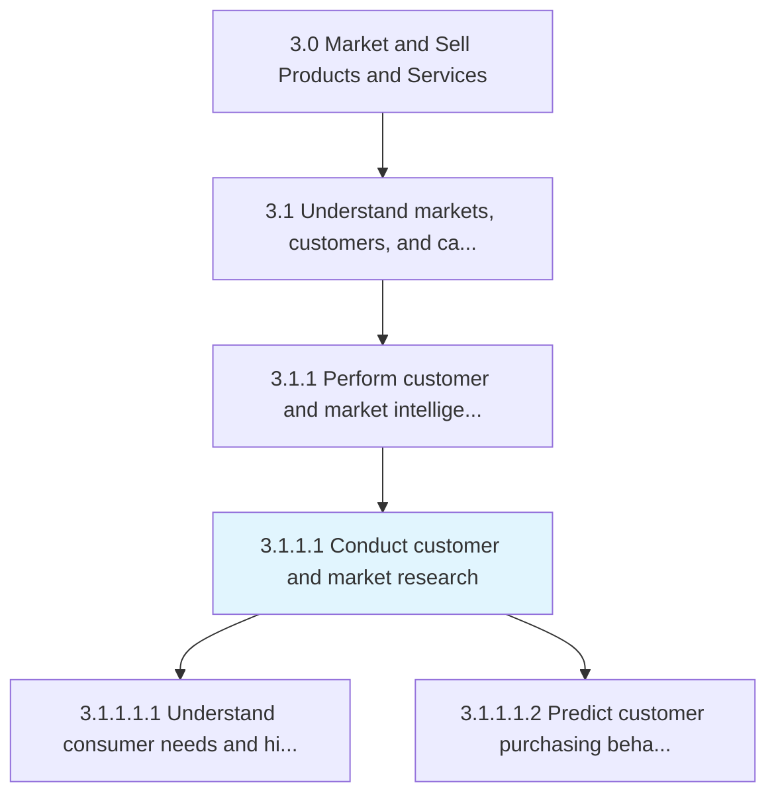
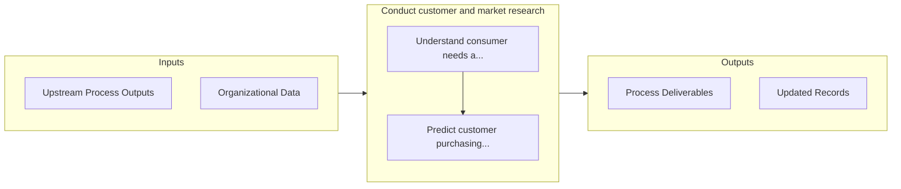

# Conduct customer and market research

> Carrying out research studies to understand the behavior of customers and the realities of the market.

## Overview

Activity 3.1.1.1 is an activity within the Market and Sell Products and Services framework. 

Carrying out research studies to understand the behavior of customers and the realities of the market. Undertake research to understand the market conditions as well as the characteristics, drives, and desires of prospective customers. Gather highly contextualized intelligence through primary and secondary research methods, with the objective of gaining insights over how to best seize a market opportunity. Consider assistance from professional research services.

## Process Hierarchy



## Key Statistics

| Metric | Value |
|--------|-------|
| APQC Code | 10108 |
| Hierarchy ID | 3.1.1.1 |
| Level | Activity |
| Parent | [3.1.1](../) |
| Sub-Processes | 2 |


## GraphDL Semantic Structure

```graphdl
conduct.CustomerAndMarketResearch
```

| Component | Value | Description |
|-----------|-------|-------------|
| Verb | `conduct` | Primary action |
| Object | `customer and market research` | Direct object |


## Process Flow



## Sub-Processes

| Process | Hierarchy ID | Description |
|---------|-------------|-------------|
| [Understand consumer needs and historical behaviors](./UnderstandConsumerNeedsAndHistoricalBehaviors) | 3.1.1.1.1 | Identifying the factors that drive the targeted market segment |
| [Predict customer purchasing behavior](./PredictCustomerPurchasingBehavior) | 3.1.1.1.2 | Using customer segmentation tools to examine past customer behavior to predict future purchasing pat |


## Related Concepts

- Customer
- MarketResearch


---

*Source: APQC PCF 10108 (3.1.1.1) - APQC*
