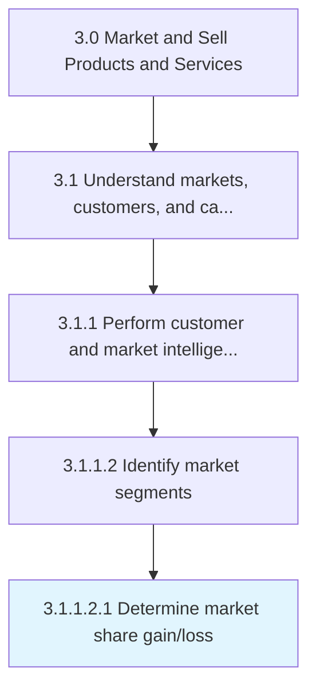

# Determine market share gain/loss

> Determining the increase or decrease of the company's sales volume in the targeted markets.

## Overview

Sub-Activity 3.1.1.2.1 is an activity within the Market and Sell Products and Services framework. 

Determining the increase or decrease of the company's sales volume in the targeted markets. Conduct an analysis to determine the factors and underlying causes that affect the changes in the demand for products or services offered. Consider changes in offerings or in the business strategy to regain or increase the market share.

## Process Hierarchy



## Key Statistics

| Metric | Value |
|--------|-------|
| APQC Code | 10115 |
| Hierarchy ID | 3.1.1.2.1 |
| Level | Sub-Activity |
| Parent | [3.1.1.2](../) |
| Sub-Processes | 0 |


## GraphDL Semantic Structure

```
determine.MarketShareGainloss
```

| Component | Value | Description |
|-----------|-------|-------------|
| Verb | `determine` | Primary action |
| Object | `market share gain/loss` | Direct object |


## Related Concepts

- MarketShareGain
- MarketShareLoss


---

*Source: APQC PCF 10115 (3.1.1.2.1) - APQC*
