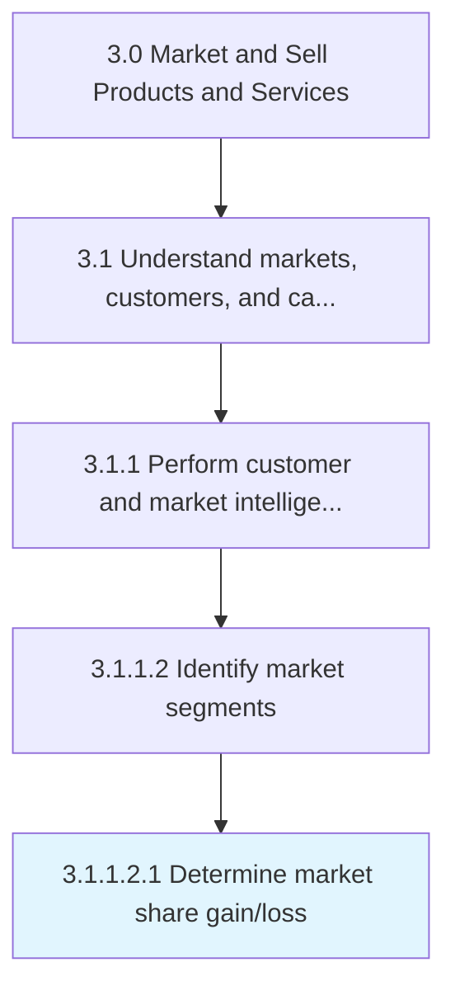
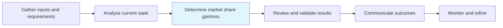

# Determine market share gain/loss

> Determining the increase or decrease of the company's sales volume in the targeted markets.

## Overview

SubActivity 3.1.1.2.1 is an activity within the Market and Sell Products and Services framework.

Determining the increase or decrease of the company's sales volume in the targeted markets. Conduct an analysis to determine the factors and underlying causes that affect the changes in the demand for products or services offered. Consider changes in offerings or in the business strategy to regain or increase the market share.

This process is critical to effective sales and marketing execution. It ensures that activities are systematically planned, executed, and measured against organizational objectives. When performed effectively, this process drives revenue growth, enhances customer engagement, and strengthens competitive positioning in target markets.

## Process Hierarchy



## Key Statistics

| Metric | Value |
|--------|-------|
| APQC Code | 10115 |
| Hierarchy ID | 3.1.1.2.1 |
| Level | SubActivity |
| Parent | [3.1.1.2](../) |
| Sub-Processes | 0 |

## Process Flow



## GraphDL Semantic Structure

```
determine.MarketShareGainloss
```

| Component | Value | Description |
|-----------|-------|-------------|
| Verb | `determine` | Primary action |
| Object | `market share gain/loss` | Direct object |


## RACI Matrix

| Role | Responsible | Accountable | Consulted | Informed |
|------|:-----------:|:-----------:|:---------:|:--------:|
| Market Research Analyst | R |  |  |  |
| Marketing Manager |  | A |  |  |
| Sales Manager |  |  | C |  |
| Product Manager |  |  | C |  |
| Executive Leadership |  |  |  | I |

## Related Occupations

- [Market Research Analysts](/occupations/Business-and-Financial-Operations/MarketResearchAnalysts)
- [Marketing Managers](/occupations/Management/MarketingManagers)
- [Management Analysts](/occupations/Business-and-Financial-Operations/ManagementAnalysts)
- [Survey Researchers](/occupations/Life-Physical-and-Social-Science/SurveyResearchers)
- [Statistical Assistants](/occupations/Office-and-Administrative-Support/StatisticalAssistants)

## Related Departments

- [Marketing](/departments/Marketing)
- [Sales](/departments/Sales)
- [Business Intelligence](/departments/BusinessIntelligence)

## Industry Variations

### Retail

In retail, determine market share gain/loss focuses on consumer behavior analytics, foot traffic patterns, and omnichannel shopping trends to inform market positioning.

### Banking

In banking, determine market share gain/loss emphasizes regulatory compliance considerations, risk profiling of market segments, and financial product demand analysis.

### Healthcare

In healthcare, determine market share gain/loss involves patient demographic analysis, payer mix evaluation, and compliance with healthcare marketing regulations.

## KPIs & Metrics

| Metric | Description | Target |
|--------|-------------|--------|
| Market Research Accuracy | Percentage of market predictions validated by actual outcomes | >80% |
| Customer Insight Generation Rate | Number of actionable insights generated per quarter | 10+ per quarter |
| Competitive Intelligence Coverage | Percentage of key competitors actively monitored | 100% |
| Time to Insight | Average time from data collection to actionable insight delivery | <2 weeks |

## Related Concepts

- MarketShareGain
- MarketShareLoss

---

*Source: APQC PCF 10115 (3.1.1.2.1) - APQC*
