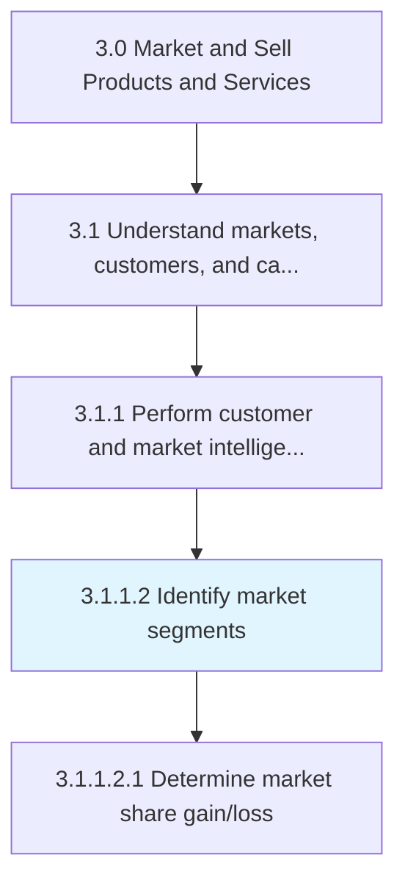
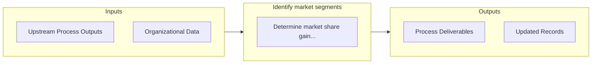

# Identify market segments

> Identifying a section of the customer population to target for marketing products/services.

## Overview

Activity 3.1.1.2 is an activity within the Market and Sell Products and Services framework. 

Identifying a section of the customer population to target for marketing products/services. Create segments within the customer population for targeted marketing campaigns, which increase the efficacy of marketing outlay. Determine the right customer segments, craft effective marketing messages, and efficiently communicate them. Determine the optimal pricing mix. Consider assistance from professional services for market segmentation studies, with coordination and oversight from the marketing/sales functions.

## Process Hierarchy



## Key Statistics

| Metric | Value |
|--------|-------|
| APQC Code | 10109 |
| Hierarchy ID | 3.1.1.2 |
| Level | Activity |
| Parent | [3.1.1](../) |
| Sub-Processes | 1 |


## GraphDL Semantic Structure

```
identify.MarketSegments
```

| Component | Value | Description |
|-----------|-------|-------------|
| Verb | `identify` | Primary action |
| Object | `market segments` | Direct object |


## Process Flow



## Sub-Processes

| Process | Hierarchy ID | Description |
|---------|-------------|-------------|
| [Determine market share gain/loss](./DetermineMarketShareGainloss) | 3.1.1.2.1 | Determining the increase or decrease of the company's sales volume in the targeted markets |


## Related Concepts

- [MarketSegments](/concepts/MarketSegments)


---

*Source: APQC PCF 10109 (3.1.1.2) - APQC*
