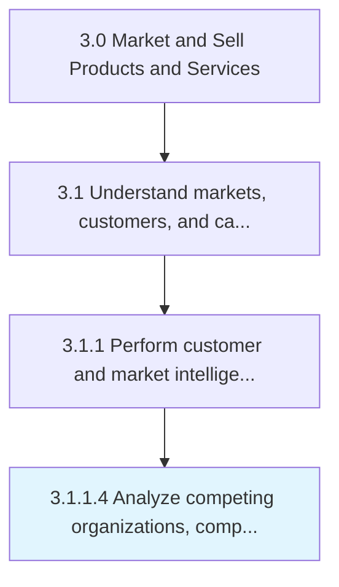

# Analyze competing organizations, competitive/substitute products/services

> Examining the strengths and weaknesses of competing organizations.

## Overview

Activity 3.1.1.4 is an activity within the Market and Sell Products and Services framework. 

Examining the strengths and weaknesses of competing organizations. Assess competing organizations for offerings, product strategy, marketing and delivery channels, etc. Analyze the usability experience, durability, USP, and other key attributes of competing and substitute products. Gather competitive intelligence, and consider enlisting professional services.

## Process Hierarchy



## Key Statistics

| Metric | Value |
|--------|-------|
| APQC Code | 10111 |
| Hierarchy ID | 3.1.1.4 |
| Level | Activity |
| Parent | [3.1.1](../) |
| Sub-Processes | 0 |


## GraphDL Semantic Structure

```
analyze.CompetingOrganizationsCompetitivesubstituteProductsservices
```

| Component | Value | Description |
|-----------|-------|-------------|
| Verb | `analyze` | Primary action |
| Object | `competing organizations, competitive/substitute products/services` | Direct object |


## Related Concepts

- [CompetingOrganizations](/concepts/CompetingOrganizations)
- [Competitive](/concepts/Competitive)
- [CompetingOrganizations](/concepts/CompetingOrganizations)
- [SubstituteProducts](/concepts/SubstituteProducts)
- [CompetingOrganizations](/concepts/CompetingOrganizations)
- [Services](/concepts/Services)


---

*Source: APQC PCF 10111 (3.1.1.4) - APQC*
