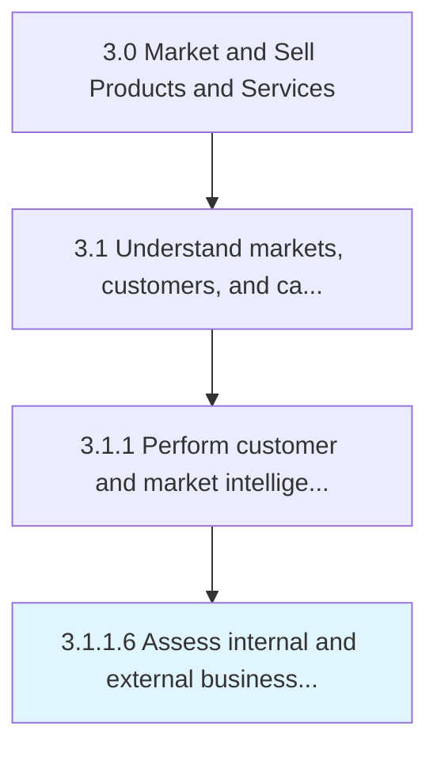

# Assess internal and external business environment

> Understanding the culture and environment in which you're operating.

## Overview

Activity 3.1.1.6 is an activity within the Market and Sell Products and Services framework. 

Understanding the culture and environment in which you're operating. Analyze how internal decision-making, thought processes, financial circumstances, and more affect the ability to bring new products to market. Survey or analyze the market into which the products would be introduced.

## Process Hierarchy



## Key Statistics

| Metric | Value |
|--------|-------|
| APQC Code | 10113 |
| Hierarchy ID | 3.1.1.6 |
| Level | Activity |
| Parent | [3.1.1](../) |
| Sub-Processes | 0 |


## GraphDL Semantic Structure

```
assess.InternalAndExternalBusinessEnvironment
```

| Component | Value | Description |
|-----------|-------|-------------|
| Verb | `assess` | Primary action |
| Object | `internal and external business environment` | Direct object |


## Related Concepts

- [InternalBusinessEnvironment](/concepts/InternalBusinessEnvironment)
- [ExternalBusinessEnvironment](/concepts/ExternalBusinessEnvironment)


---

*Source: APQC PCF 10113 (3.1.1.6) - APQC*
