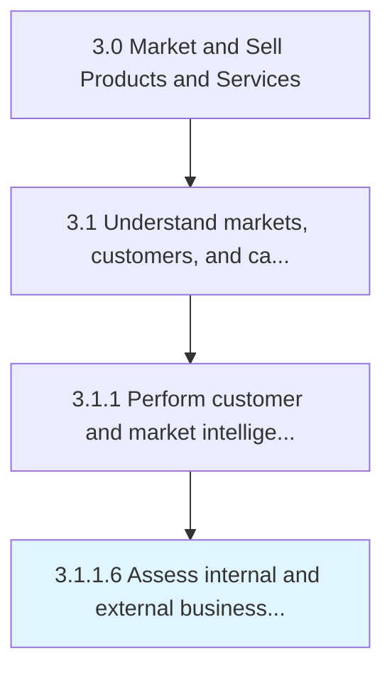
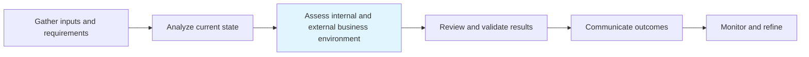

# Assess internal and external business environment

> Understanding the culture and environment in which you're operating.

## Overview

Activity 3.1.1.6 is an activity within the Market and Sell Products and Services framework.

Understanding the culture and environment in which you're operating. Analyze how internal decision-making, thought processes, financial circumstances, and more affect the ability to bring new products to market. Survey or analyze the market into which the products would be introduced.

This process is critical to effective sales and marketing execution. It ensures that activities are systematically planned, executed, and measured against organizational objectives. When performed effectively, this process drives revenue growth, enhances customer engagement, and strengthens competitive positioning in target markets.

## Process Hierarchy



## Key Statistics

| Metric | Value |
|--------|-------|
| APQC Code | 10113 |
| Hierarchy ID | 3.1.1.6 |
| Level | Activity |
| Parent | [3.1.1](../) |
| Sub-Processes | 0 |

## Process Flow



## GraphDL Semantic Structure

```graphdl
assess.InternalAndExternalBusinessEnvironment
```

| Component | Value | Description |
|-----------|-------|-------------|
| Verb | `assess` | Primary action |
| Object | `internal and external business environment` | Direct object |


## RACI Matrix

| Role | Responsible | Accountable | Consulted | Informed |
|------|:-----------:|:-----------:|:---------:|:--------:|
| Market Research Analyst | R |  |  |  |
| Marketing Manager |  | A |  |  |
| Sales Manager |  |  | C |  |
| Product Manager |  |  | C |  |
| Executive Leadership |  |  |  | I |

## Related Occupations

- [Market Research Analysts](/occupations/Business-and-Financial-Operations/MarketResearchAnalysts)
- [Marketing Managers](/occupations/Management/MarketingManagers)
- [Management Analysts](/occupations/Business-and-Financial-Operations/ManagementAnalysts)
- [Survey Researchers](/occupations/Life-Physical-and-Social-Science/SurveyResearchers)
- [Statistical Assistants](/occupations/Office-and-Administrative-Support/StatisticalAssistants)

## Related Departments

- [Marketing](/departments/Marketing)
- [Sales](/departments/Sales)
- Business Intelligence

## Industry Variations

### Retail

In retail, assess internal and external business environment focuses on consumer behavior analytics, foot traffic patterns, and omnichannel shopping trends to inform market positioning.

### Banking

In banking, assess internal and external business environment emphasizes regulatory compliance considerations, risk profiling of market segments, and financial product demand analysis.

### Healthcare

In healthcare, assess internal and external business environment involves patient demographic analysis, payer mix evaluation, and compliance with healthcare marketing regulations.

## KPIs & Metrics

| Metric | Description | Target |
|--------|-------------|--------|
| Market Research Accuracy | Percentage of market predictions validated by actual outcomes | >80% |
| Customer Insight Generation Rate | Number of actionable insights generated per quarter | 10+ per quarter |
| Competitive Intelligence Coverage | Percentage of key competitors actively monitored | 100% |
| Time to Insight | Average time from data collection to actionable insight delivery | <2 weeks |

## Related Concepts

- InternalBusinessEnvironment
- ExternalBusinessEnvironment

---

*Source: APQC PCF 10113 (3.1.1.6) - APQC*
