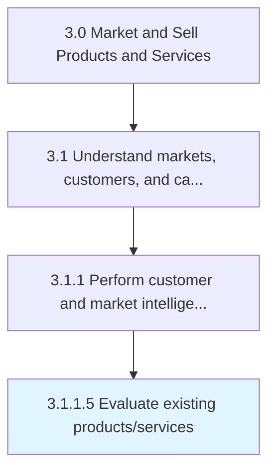

# Evaluate existing products/services

> Examining the brands owned and products offered in the market.

## Overview

Activity 3.1.1.5 is an activity within the Market and Sell Products and Services framework. 

Examining the brands owned and products offered in the market. Determine the relative position of the existing products/brands in the marketplace.

## Process Hierarchy



## Key Statistics

| Metric | Value |
|--------|-------|
| APQC Code | 10112 |
| Hierarchy ID | 3.1.1.5 |
| Level | Activity |
| Parent | [3.1.1](../) |
| Sub-Processes | 0 |


## GraphDL Semantic Structure

```
evaluate.ExistingProductsservices
```

| Component | Value | Description |
|-----------|-------|-------------|
| Verb | `evaluate` | Primary action |
| Object | `existing products/services` | Direct object |


## Related Concepts

- ExistingProducts
- ExistingServices


---

*Source: APQC PCF 10112 (3.1.1.5) - APQC*
