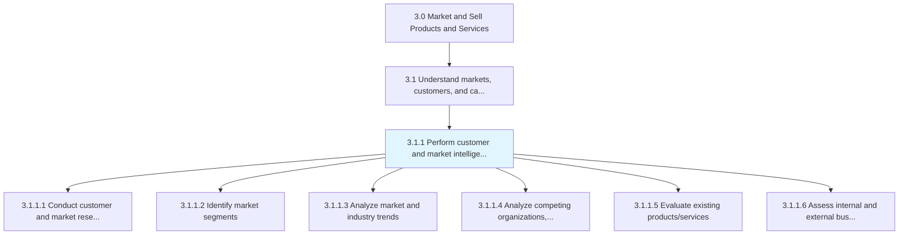
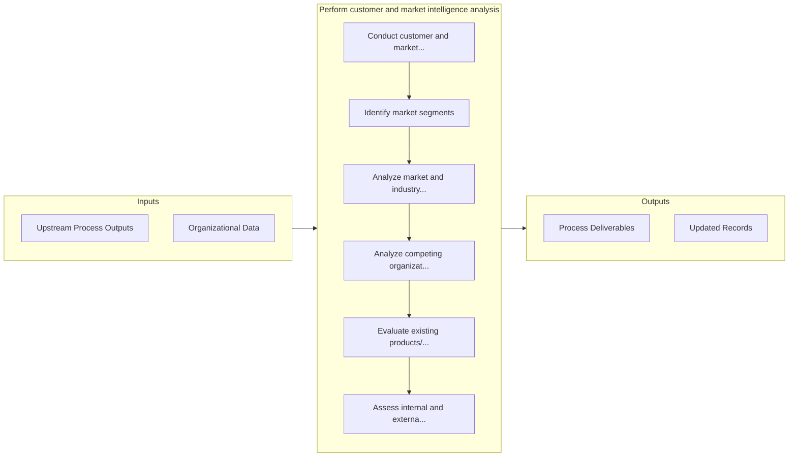

# Perform customer and market intelligence analysis

> Gathering intelligence on the market and customers.

## Overview

Process 3.1.1 is a core process that defines the specific procedures for perform customer and market intelligence analysis. 

Gathering intelligence on the market and customers. Closely examine the inherent attributes and collective behavior of the various market and customer segments. Track trends in the market. Determine what drives the customers to make purchasing decisions in order to identify opportunities in the market.

## Process Hierarchy



## Key Statistics

| Metric | Value |
|--------|-------|
| APQC Code | 10106 |
| Hierarchy ID | 3.1.1 |
| Level | Process |
| Parent | [3.1](../) |
| Sub-Processes | 6 |


## GraphDL Semantic Structure

```
perform.CustomerAndMarketIntelligenceAnalysis
```

| Component | Value | Description |
|-----------|-------|-------------|
| Verb | `perform` | Primary action |
| Object | `customer and market intelligence analysis` | Direct object |


## Process Flow



## Sub-Processes

| Process | Hierarchy ID | Description |
|---------|-------------|-------------|
| [Conduct customer and market research](./3.1.1.1-ConductCustomerMarketResearch/) | 3.1.1.1 | Carrying out research studies to understand the behavior of customers and the realities of the marke |
| [Identify market segments](./3.1.1.2-IdentifyMarketSegments/) | 3.1.1.2 | Identifying a section of the customer population to target for marketing products/services |
| [Analyze market and industry trends](./AnalyzeMarketAndIndustryTrends) | 3.1.1.3 | Examining large-scale shifts and trends, with relevance to the organization's products/services |
| [Analyze competing organizations, competitive/substitute products/services](./AnalyzeCompetingOrganizationsCompetitivesubstituteProductsservices) | 3.1.1.4 | Examining the strengths and weaknesses of competing organizations |
| [Evaluate existing products/services](./EvaluateExistingProductsservices) | 3.1.1.5 | Examining the brands owned and products offered in the market |
| [Assess internal and external business environment](./AssessInternalAndExternalBusinessEnvironment) | 3.1.1.6 | Understanding the culture and environment in which you're operating |


## Related Concepts

- Customer
- MarketIntelligenceAnalysis


---

*Source: APQC PCF 10106 (3.1.1) - APQC*
