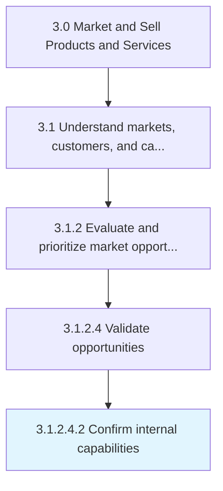
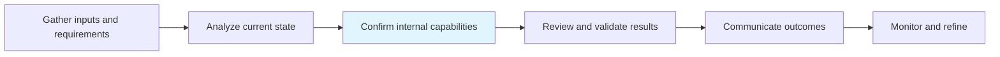

# Confirm internal capabilities

> Verifying that the company has sufficient infrastructure and resources to deliver their offerings in a timely and cost-effective manner, and that it is able to scale up from the small-scale market samples, used for consumer testing, to the entire identified market segment.

## Overview

SubActivity 3.1.2.4.2 is an activity within the Market and Sell Products and Services framework.

Verifying that the company has sufficient infrastructure and resources to deliver their offerings in a timely and cost-effective manner, and that it is able to scale up from the small-scale market samples, used for consumer testing, to the entire identified market segment.

This process is critical to effective sales and marketing execution. It ensures that activities are systematically planned, executed, and measured against organizational objectives. When performed effectively, this process drives revenue growth, enhances customer engagement, and strengthens competitive positioning in target markets.

## Process Hierarchy



## Key Statistics

| Metric | Value |
|--------|-------|
| APQC Code | 10121 |
| Hierarchy ID | 3.1.2.4.2 |
| Level | SubActivity |
| Parent | [3.1.2.4](../) |
| Sub-Processes | 0 |

## Process Flow



## GraphDL Semantic Structure

```graphdl
confirm.InternalCapabilities
```

| Component | Value | Description |
|-----------|-------|-------------|
| Verb | `confirm` | Primary action |
| Object | `internal capabilities` | Direct object |


## RACI Matrix

| Role | Responsible | Accountable | Consulted | Informed |
|------|:-----------:|:-----------:|:---------:|:--------:|
| Market Research Analyst | R |  |  |  |
| Marketing Manager |  | A |  |  |
| Sales Manager |  |  | C |  |
| Product Manager |  |  | C |  |
| Executive Leadership |  |  |  | I |

## Related Occupations

- [Market Research Analysts](/occupations/Business-and-Financial-Operations/MarketResearchAnalysts)
- [Marketing Managers](/occupations/Management/MarketingManagers)
- [Management Analysts](/occupations/Business-and-Financial-Operations/ManagementAnalysts)
- [Survey Researchers](/occupations/Life-Physical-and-Social-Science/SurveyResearchers)
- [Statistical Assistants](/occupations/Office-and-Administrative-Support/StatisticalAssistants)

## Related Departments

- [Marketing](/departments/Marketing)
- [Sales](/departments/Sales)
- Business Intelligence

## Industry Variations

### Retail

In retail, confirm internal capabilities focuses on consumer behavior analytics, foot traffic patterns, and omnichannel shopping trends to inform market positioning.

### Banking

In banking, confirm internal capabilities emphasizes regulatory compliance considerations, risk profiling of market segments, and financial product demand analysis.

### Healthcare

In healthcare, confirm internal capabilities involves patient demographic analysis, payer mix evaluation, and compliance with healthcare marketing regulations.

## KPIs & Metrics

| Metric | Description | Target |
|--------|-------------|--------|
| Market Research Accuracy | Percentage of market predictions validated by actual outcomes | >80% |
| Customer Insight Generation Rate | Number of actionable insights generated per quarter | 10+ per quarter |
| Competitive Intelligence Coverage | Percentage of key competitors actively monitored | 100% |
| Time to Insight | Average time from data collection to actionable insight delivery | <2 weeks |

## Related Concepts

- InternalCapabilities

---

*Source: APQC PCF 10121 (3.1.2.4.2) - APQC*
