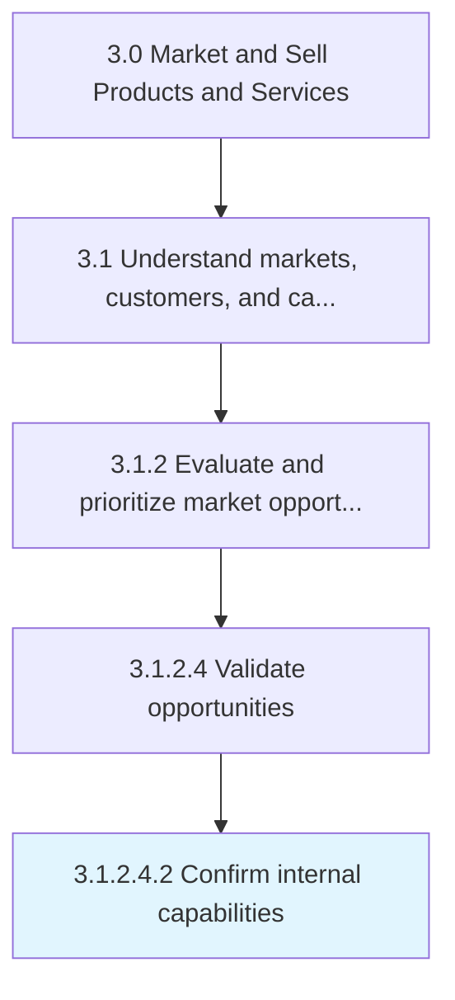

# Confirm internal capabilities

> Verifying that the company has sufficient infrastructure and resources to deliver their offerings in a timely and cost-effective manner, and that it is able to scale up from the small-scale market samples, used for consumer testing, to the entire identified market segment.

## Overview

Sub-Activity 3.1.2.4.2 is an activity within the Market and Sell Products and Services framework. 

Verifying that the company has sufficient infrastructure and resources to deliver their offerings in a timely and cost-effective manner, and that it is able to scale up from the small-scale market samples, used for consumer testing, to the entire identified market segment.

## Process Hierarchy



## Key Statistics

| Metric | Value |
|--------|-------|
| APQC Code | 10121 |
| Hierarchy ID | 3.1.2.4.2 |
| Level | Sub-Activity |
| Parent | [3.1.2.4](../) |
| Sub-Processes | 0 |


## GraphDL Semantic Structure

```
confirm.InternalCapabilities
```

| Component | Value | Description |
|-----------|-------|-------------|
| Verb | `confirm` | Primary action |
| Object | `internal capabilities` | Direct object |


## Related Concepts

- InternalCapabilities


---

*Source: APQC PCF 10121 (3.1.2.4.2) - APQC*
