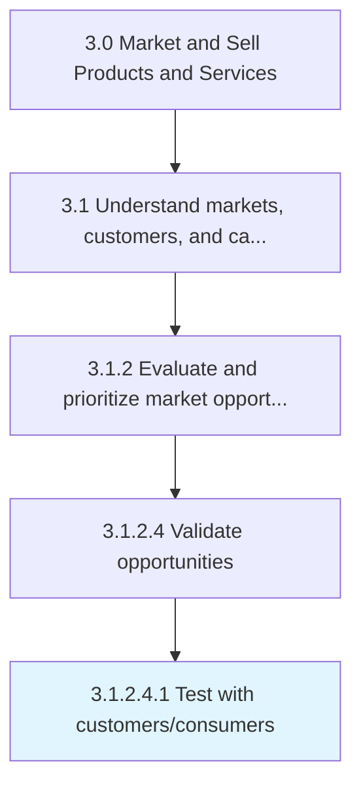

# Test with customers/consumers

> Validating identified market opportunities by testing company's offerings on limited-size samples of the consumer population that are hypothesized to be representative of the target market at large and to have similar purchasing behavior.

## Overview

Sub-Activity 3.1.2.4.1 is an activity within the Market and Sell Products and Services framework. 

Validating identified market opportunities by testing company's offerings on limited-size samples of the consumer population that are hypothesized to be representative of the target market at large and to have similar purchasing behavior. The feedback gained through consumer testing can be used to modify or reject product offerings before their full scale launch, saving the company valuable resources, should the initial offering not be successful.

## Process Hierarchy



## Key Statistics

| Metric | Value |
|--------|-------|
| APQC Code | 10120 |
| Hierarchy ID | 3.1.2.4.1 |
| Level | Sub-Activity |
| Parent | [3.1.2.4](../) |
| Sub-Processes | 0 |


## GraphDL Semantic Structure

```
test.WithCustomersconsumers
```

| Component | Value | Description |
|-----------|-------|-------------|
| Verb | `test` | Primary action |
| Object | `with customers/consumers` | Direct object |


## Related Concepts

- Customers
- Consumers


---

*Source: APQC PCF 10120 (3.1.2.4.1) - APQC*
