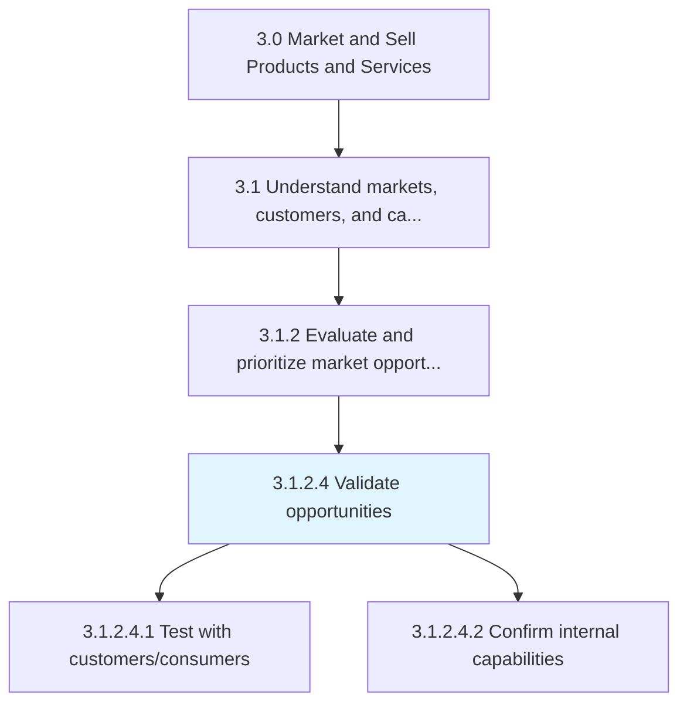
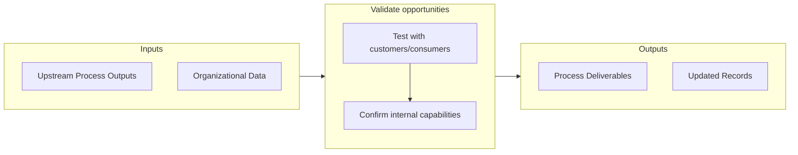

# Validate opportunities

> Confirming the practicability and reasonableness of the market opportunities that have been identified.

## Overview

Activity 3.1.2.4 is an activity within the Market and Sell Products and Services framework. 

Confirming the practicability and reasonableness of the market opportunities that have been identified. Give substance to the real-time feasibility of the market opportunities.

## Process Hierarchy



## Key Statistics

| Metric | Value |
|--------|-------|
| APQC Code | 10119 |
| Hierarchy ID | 3.1.2.4 |
| Level | Activity |
| Parent | [3.1.2](../) |
| Sub-Processes | 2 |


## GraphDL Semantic Structure

```
validate.Opportunities
```

| Component | Value | Description |
|-----------|-------|-------------|
| Verb | `validate` | Primary action |
| Object | `opportunities` | Direct object |


## Process Flow



## Sub-Processes

| Process | Hierarchy ID | Description |
|---------|-------------|-------------|
| [Test with customers/consumers](./TestWithCustomersconsumers) | 3.1.2.4.1 | Validating identified market opportunities by testing company's offerings on limited-size samples of |
| [Confirm internal capabilities](./ConfirmInternalCapabilities) | 3.1.2.4.2 | Verifying that the company has sufficient infrastructure and resources to deliver their offerings in |


## Related Concepts

- [Opportunities](/concepts/Opportunities)


---

*Source: APQC PCF 10119 (3.1.2.4) - APQC*
