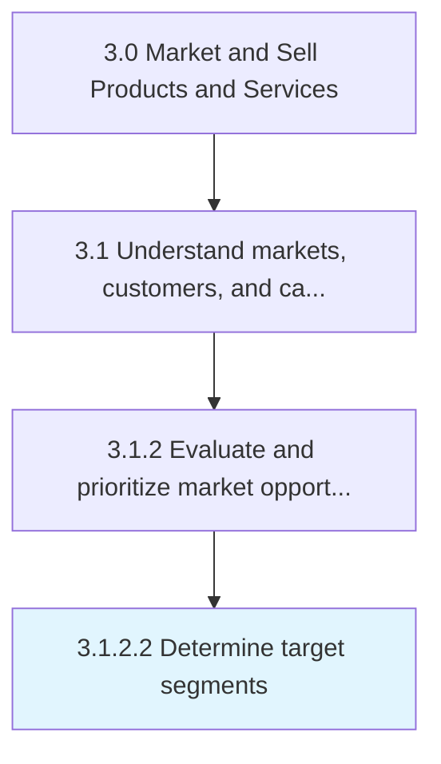

# Determine target segments

> Identifying the targeted segment of customers.

## Overview

Activity 3.1.2.2 is an activity within the Market and Sell Products and Services framework. 

Identifying the targeted segment of customers. Deduce those particular customer segments that are to be targeted from among the market segments.

## Process Hierarchy



## Key Statistics

| Metric | Value |
|--------|-------|
| APQC Code | 10117 |
| Hierarchy ID | 3.1.2.2 |
| Level | Activity |
| Parent | [3.1.2](../) |
| Sub-Processes | 0 |


## GraphDL Semantic Structure

```
determine.TargetSegments
```

| Component | Value | Description |
|-----------|-------|-------------|
| Verb | `determine` | Primary action |
| Object | `target segments` | Direct object |


## Related Concepts

- TargetSegments


---

*Source: APQC PCF 10117 (3.1.2.2) - APQC*
