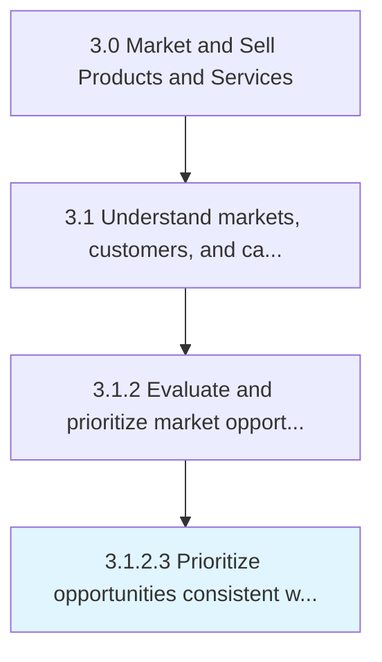

# Identify under-served and saturated market segments

> Determining which groups of potential customers do not yet, or already do have access to the product or a service that the company produces or markets.

## Overview

Activity 3.1.2.3 is an activity within the Market and Sell Products and Services framework. 

Determining which groups of potential customers do not yet, or already do have access to the product or a service that the company produces or markets. Use those findings to create specialized product offerings and differentiated marketing campaigns.

## Process Hierarchy



## Key Statistics

| Metric | Value |
|--------|-------|
| APQC Code | 18941 |
| Hierarchy ID | 3.1.2.3 |
| Level | Activity |
| Parent | [3.1.2](../) |
| Sub-Processes | 0 |


## GraphDL Semantic Structure

```
identify.UnderservedAndSaturatedMarketSegments
```

| Component | Value | Description |
|-----------|-------|-------------|
| Verb | `identify` | Primary action |
| Object | `under-served and saturated market segments` | Direct object |


---

*Source: APQC PCF 18941 (3.1.2.3) - APQC*
