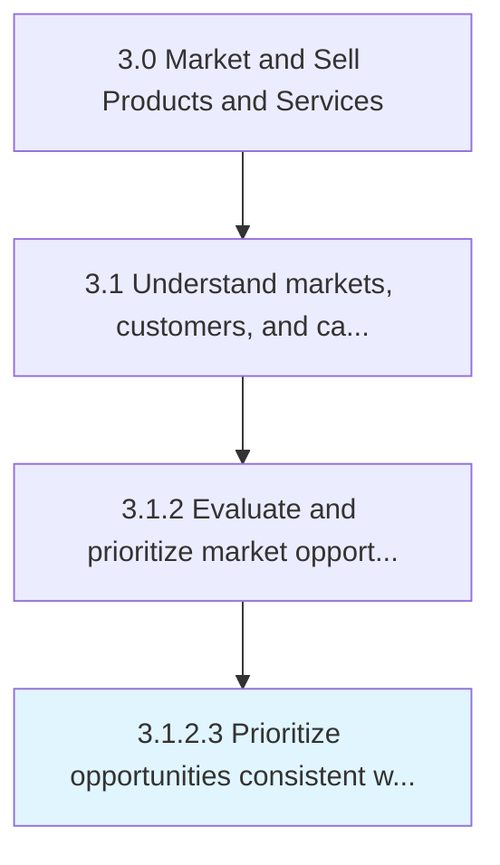

# Prioritize opportunities consistent with capabilities and overall business strategy

> Creating an index of market opportunities, and arrange them in order of preference.

## Overview

Activity 3.1.2.3 is an activity within the Market and Sell Products and Services framework. 

Creating an index of market opportunities, and arrange them in order of preference. Prioritize based on the opportunities' adherence to the overall business strategy. Correlate with the competencies and capacities that the organization, as a whole, processes.

## Process Hierarchy



## Key Statistics

| Metric | Value |
|--------|-------|
| APQC Code | 10118 |
| Hierarchy ID | 3.1.2.3 |
| Level | Activity |
| Parent | [3.1.2](../) |
| Sub-Processes | 0 |


## GraphDL Semantic Structure

```
prioritize.OpportunitiesConsistent.with.CapabilitiesAndOverallBusinessStrategy
```

| Component | Value | Description |
|-----------|-------|-------------|
| Verb | `prioritize` | Primary action |
| Object | `opportunities consistent` | Direct object |
| Preposition | `with` | Relationship |
| PrepObject | `capabilities and overall business strategy` | Indirect object |


## Related Concepts

- OpportunitiesConsistent
- CapabilitiesBusinessStrategy
- OpportunitiesConsistent
- OverallBusinessStrategy


---

*Source: APQC PCF 10118 (3.1.2.3) - APQC*
