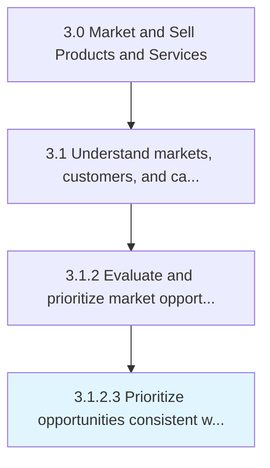
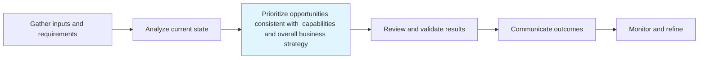

# Prioritize opportunities consistent with capabilities and overall business strategy

> Creating an index of market opportunities, and arrange them in order of preference.

## Overview

Activity 3.1.2.3 is an activity within the Market and Sell Products and Services framework.

Creating an index of market opportunities, and arrange them in order of preference. Prioritize based on the opportunities' adherence to the overall business strategy. Correlate with the competencies and capacities that the organization, as a whole, processes.

This process is critical to effective sales and marketing execution. It ensures that activities are systematically planned, executed, and measured against organizational objectives. When performed effectively, this process drives revenue growth, enhances customer engagement, and strengthens competitive positioning in target markets.

## Process Hierarchy



## Key Statistics

| Metric | Value |
|--------|-------|
| APQC Code | 10118 |
| Hierarchy ID | 3.1.2.3 |
| Level | Activity |
| Parent | [3.1.2](../) |
| Sub-Processes | 0 |

## Process Flow



## GraphDL Semantic Structure

```graphdl
prioritize.OpportunitiesConsistent.with.CapabilitiesAndOverallBusinessStrategy
```

| Component | Value | Description |
|-----------|-------|-------------|
| Verb | `prioritize` | Primary action |
| Object | `opportunities consistent` | Direct object |
| Preposition | `with` | Relationship |
| PrepObject | `capabilities and overall business strategy` | Indirect object |


## RACI Matrix

| Role | Responsible | Accountable | Consulted | Informed |
|------|:-----------:|:-----------:|:---------:|:--------:|
| Market Research Analyst | R |  |  |  |
| Marketing Manager |  | A |  |  |
| Sales Manager |  |  | C |  |
| Product Manager |  |  | C |  |
| Executive Leadership |  |  |  | I |

## Related Occupations

- [Market Research Analysts](/occupations/Business-and-Financial-Operations/MarketResearchAnalysts)
- [Marketing Managers](/occupations/Management/MarketingManagers)
- [Management Analysts](/occupations/Business-and-Financial-Operations/ManagementAnalysts)
- [Survey Researchers](/occupations/Life-Physical-and-Social-Science/SurveyResearchers)
- [Statistical Assistants](/occupations/Office-and-Administrative-Support/StatisticalAssistants)

## Related Departments

- [Marketing](/departments/Marketing)
- [Sales](/departments/Sales)
- Business Intelligence

## Industry Variations

### Retail

In retail, prioritize opportunities consistent with capabilities and overall business strategy focuses on consumer behavior analytics, foot traffic patterns, and omnichannel shopping trends to inform market positioning.

### Banking

In banking, prioritize opportunities consistent with capabilities and overall business strategy emphasizes regulatory compliance considerations, risk profiling of market segments, and financial product demand analysis.

### Healthcare

In healthcare, prioritize opportunities consistent with capabilities and overall business strategy involves patient demographic analysis, payer mix evaluation, and compliance with healthcare marketing regulations.

## KPIs & Metrics

| Metric | Description | Target |
|--------|-------------|--------|
| Market Research Accuracy | Percentage of market predictions validated by actual outcomes | >80% |
| Customer Insight Generation Rate | Number of actionable insights generated per quarter | 10+ per quarter |
| Competitive Intelligence Coverage | Percentage of key competitors actively monitored | 100% |
| Time to Insight | Average time from data collection to actionable insight delivery | <2 weeks |

## Related Concepts

- OpportunitiesConsistent
- CapabilitiesBusinessStrategy
- OpportunitiesConsistent
- OverallBusinessStrategy

---

*Source: APQC PCF 10118 (3.1.2.3) - APQC*
