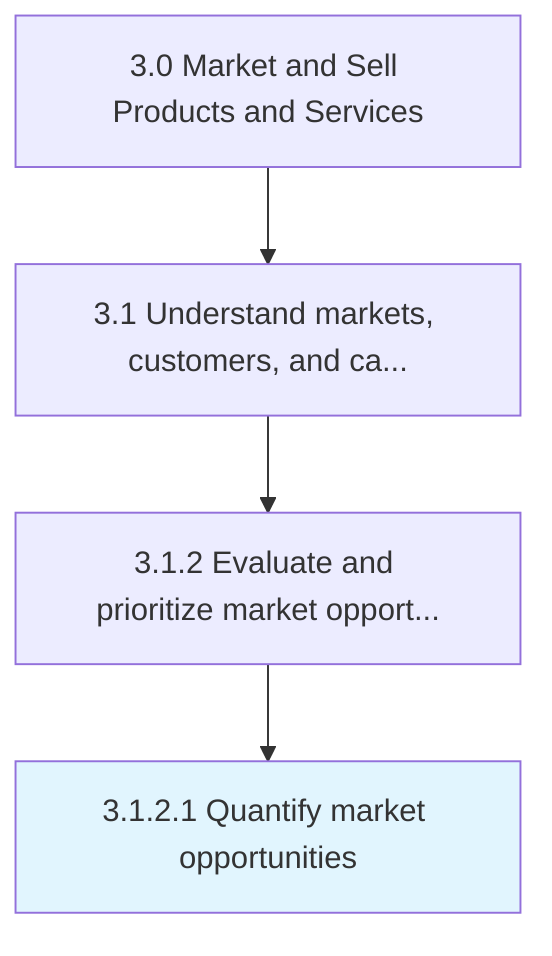

# Quantify market opportunities

> Attaching quantifiable indicators to opportunities that have been identified in the market.

## Overview

Activity 3.1.2.1 is an activity within the Market and Sell Products and Services framework. 

Attaching quantifiable indicators to opportunities that have been identified in the market. Compute estimated figures of the approximate value that can be captured with the provision of existing products/services (i.e., the extent of financial benefits that can be reaped in the market).

## Process Hierarchy



## Key Statistics

| Metric | Value |
|--------|-------|
| APQC Code | 10116 |
| Hierarchy ID | 3.1.2.1 |
| Level | Activity |
| Parent | [3.1.2](../) |
| Sub-Processes | 0 |


## GraphDL Semantic Structure

```
quantify.MarketOpportunities
```

| Component | Value | Description |
|-----------|-------|-------------|
| Verb | `quantify` | Primary action |
| Object | `market opportunities` | Direct object |


## Related Concepts

- MarketOpportunities


---

*Source: APQC PCF 10116 (3.1.2.1) - APQC*
