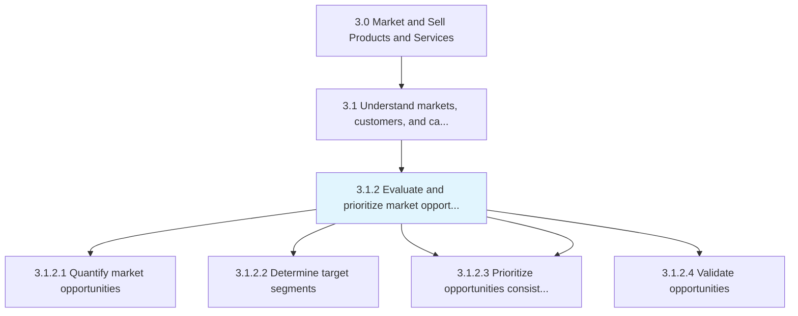
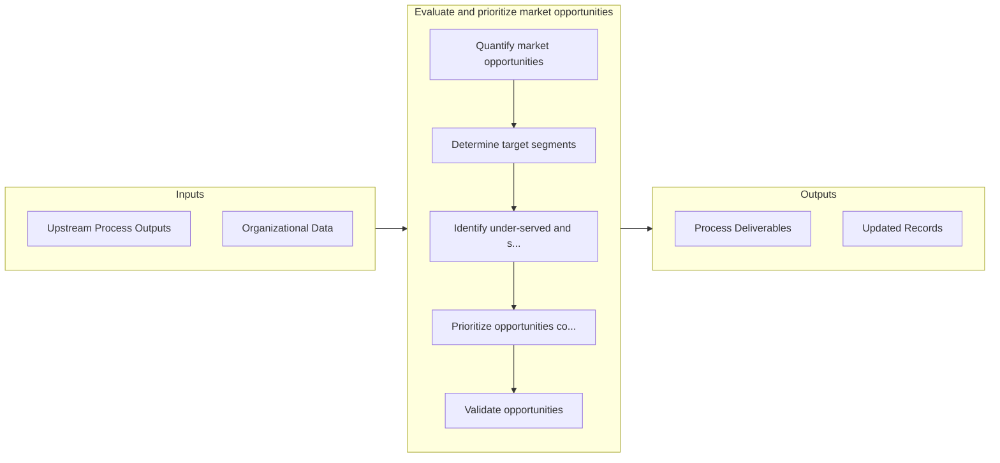

# Evaluate and prioritize market opportunities

> Appraising market opportunities by quantifying and subjecting them to prioritization, as well as validation tests.

## Overview

Process 3.1.2 is a core process that defines the specific procedures for evaluate and prioritize market opportunities. 

Appraising market opportunities by quantifying and subjecting them to prioritization, as well as validation tests. Closely examine the market opportunities that have been identified by Perform customer and market intelligence analysis [10106]. Triangulate those opportunities to capitalize by finding a fit between identified opportunities and the composite of organizational capabilities and business strategy.

## Process Hierarchy



## Key Statistics

| Metric | Value |
|--------|-------|
| APQC Code | 10107 |
| Hierarchy ID | 3.1.2 |
| Level | Process |
| Parent | [3.1](../) |
| Sub-Processes | 5 |


## GraphDL Semantic Structure

```graphdl
evaluate.AndPrioritizeMarketOpportunities
```

| Component | Value | Description |
|-----------|-------|-------------|
| Verb | `evaluate` | Primary action |
| Object | `and prioritize market opportunities` | Direct object |


## Process Flow



## Sub-Processes

| Process | Hierarchy ID | Description |
|---------|-------------|-------------|
| [Quantify market opportunities](./QuantifyMarketOpportunities) | 3.1.2.1 | Attaching quantifiable indicators to opportunities that have been identified in the market |
| [Determine target segments](./DetermineTargetSegments) | 3.1.2.2 | Identifying the targeted segment of customers |
| [Identify under-served and saturated market segments](./IdentifyUnderservedAndSaturatedMarketSegments) | 3.1.2.3 | Determining which groups of potential customers do not yet, or already do have access to the product |
| [Prioritize opportunities consistent with capabilities and overall business strategy](./PrioritizeOpportunitiesConsistentWithCapabilitiesAndOverallBusinessStrategy) | 3.1.2.3 | Creating an index of market opportunities, and arrange them in order of preference |
| [Validate opportunities](./3.1.2.4-ValidateOpportunities/) | 3.1.2.4 | Confirming the practicability and reasonableness of the market opportunities that have been identifi |


## Related Concepts

- MarketOpportunities
- MarketOpportunities


---

*Source: APQC PCF 10107 (3.1.2) - APQC*
