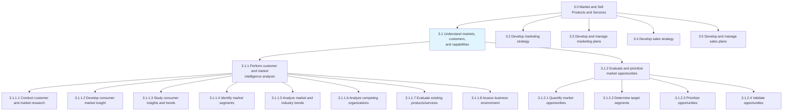
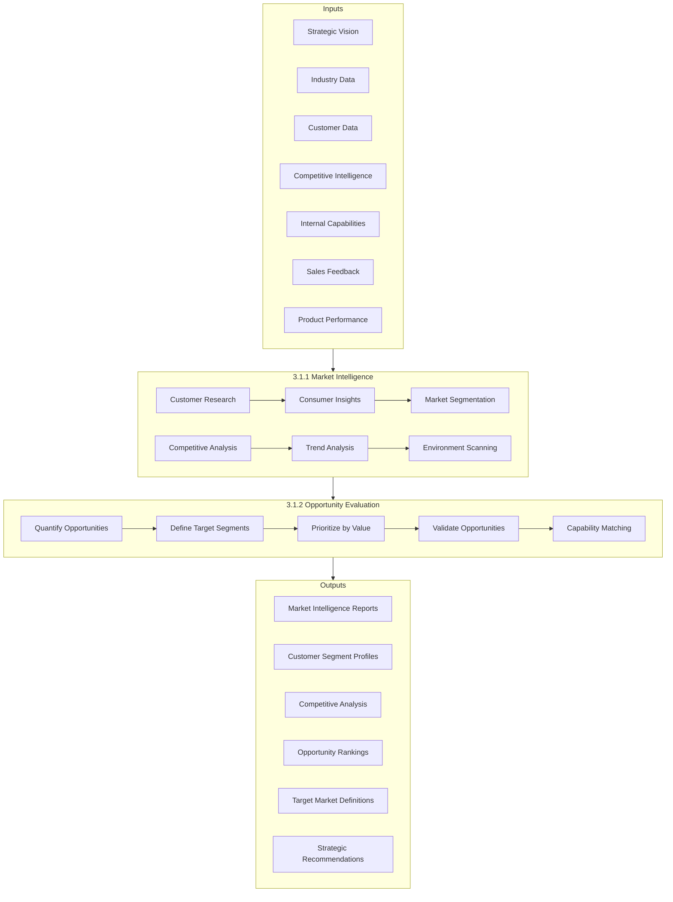
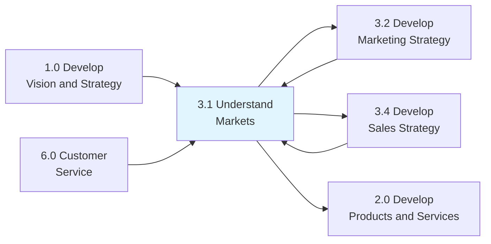

# Understand markets, customers, and capabilities

> Making sense of the market and customers to identify the right opportunities to be capitalized, given the organization's competencies.

## Overview

Process Group 3.1 - Understand Markets, Customers, and Capabilities is the foundational process group within the Market and Sell Products and Services category. This group provides the intelligence and insights that inform all downstream marketing and sales activities.

Organizations that excel in this process group develop deep understanding of their markets, customers, and competitive landscape. They systematically gather, analyze, and act on market intelligence to identify opportunities that align with their capabilities and strategic direction. This understanding drives effective marketing strategy, sales execution, and product development.

The processes in this group combine both primary research (direct customer interaction) and secondary research (industry data, competitive intelligence) to build a comprehensive view of market dynamics. The outputs feed directly into marketing strategy development (3.2), marketing plan execution (3.3), and sales strategy (3.4).

## Process Hierarchy



## Key Statistics

| Metric | Value |
|--------|-------|
| APQC Code | 10101 |
| Hierarchy ID | 3.1 |
| Level | Process Group |
| Parent | [3.0 Market and Sell Products and Services](../) |
| Child Processes | 2 |
| Total Activities | 12 |
| Integration Points | Strategy, Product, Sales |

## GraphDL Semantic Structure

```graphdl
understand.MarketsCustomersAndCapabilities
```

| Component | Value | Description |
|-----------|-------|-------------|
| Verb | `understand` | Comprehending and analyzing |
| Object | `MarketsCustomersAndCapabilities` | Market landscape, customer needs, organizational strengths |
| Preposition | - | Not applicable |
| PrepObject | - | Not applicable |

## Process Flow



## Child Processes

### [3.1.1 Perform customer and market intelligence analysis](./3.1.1-PerformCustomerMarketIntelligence/)

Gathering intelligence on the market and customers. Closely examine the inherent attributes and collective behavior of the various market and customer segments. Track trends in the market. Determine what drives customers to make purchasing decisions in order to identify opportunities.

**Key Activities:**
- Conduct customer and market research (primary and secondary)
- Develop consumer/shopper market insights
- Study consumer insights and emerging trends
- Identify and profile market segments
- Analyze market and industry trends
- Analyze competing organizations
- Evaluate existing products and services
- Assess internal and external business environment

**APQC Code:** 10102 | **Typical Duration:** Ongoing, with quarterly deep-dives

### [3.1.2 Evaluate and prioritize market opportunities](./3.1.2-EvaluatePrioritizeMarketOpportunities/)

Appraising market opportunities by quantifying and subjecting them to prioritization, as well as validation tests. Closely examine the market opportunities that have been identified by market intelligence analysis. Triangulate those opportunities to capitalize by finding a fit between identified opportunities and the composite of organizational capabilities and business strategy.

**Key Activities:**
- Quantify market opportunities (TAM, SAM, SOM)
- Determine target segments and personas
- Prioritize opportunities consistent with capabilities
- Validate opportunities through market testing
- Assess capability requirements and gaps

**APQC Code:** 10103 | **Typical Duration:** Quarterly cycles

## Market Intelligence Framework

| Dimension | Focus Areas | Key Questions |
|-----------|-------------|---------------|
| Market Size | TAM, SAM, SOM, growth rates | How big is the opportunity? |
| Customer Needs | Pain points, jobs-to-be-done, unmet needs | What do customers need? |
| Competition | Direct, indirect, substitutes | Who are we competing with? |
| Trends | Technology, demographic, regulatory | What is changing? |
| Capabilities | Core competencies, gaps, investments | What can we do well? |

## RACI Matrix

| Activity | Responsible | Accountable | Consulted | Informed |
|----------|-------------|-------------|-----------|----------|
| Market research design | Market Research Team | CMO | Sales, Product | Strategy |
| Customer research execution | Market Research | VP Marketing | Customer Success | Leadership |
| Competitive intelligence | Competitive Intel Team | VP Strategy | Sales, Product | All |
| Segment analysis | Marketing Analytics | CMO | Sales, Finance | Product |
| Opportunity quantification | Business Development | CFO | Finance, Strategy | Board |
| Capability assessment | Strategy Team | COO | All Functions | Leadership |
| Opportunity prioritization | Executive Team | CEO | All Leaders | All |

## Metrics & KPIs

| Metric | Description | Target | Frequency |
|--------|-------------|--------|-----------|
| Market Coverage | Percentage of addressable market analyzed | >80% | Quarterly |
| Insight Accuracy | Predictions validated by actual outcomes | >75% | Annually |
| Time to Insight | Days from research initiation to delivery | <30 days | Per project |
| Competitive Coverage | Competitors monitored vs. relevant | >90% | Monthly |
| Opportunity Conversion | Prioritized opportunities that succeed | >40% | Annually |
| Research Utilization | Insights informing actual decisions | >70% | Quarterly |
| Customer Understanding | NPS/satisfaction correlation accuracy | >80% | Quarterly |
| Segment Accuracy | Segment behavior matching predictions | >75% | Annually |

## Related Departments

| Department | Role in Market Understanding |
|------------|------------------------------|
| Marketing | Primary ownership of market research |
| Sales | Customer insights and market feedback |
| Strategy | Capability assessment and prioritization |
| Business Development | Opportunity identification and quantification |
| Product Management | Product-market fit analysis |
| Customer Success | Voice of customer and satisfaction data |
| Finance | Market sizing and opportunity valuation |

## Related Occupations

- [Market Research Analysts](/occupations/Business/MarketResearchAnalysts) - Primary research execution
- [Marketing Managers](/occupations/Management/MarketingManagers) - Research oversight and strategy
- [Business Intelligence Analysts](/occupations/Technology/BusinessIntelligenceAnalysts) - Data analysis
- [Competitive Intelligence Analysts](/occupations/Business/CompetitiveIntelligenceAnalysts) - Competitor monitoring
- [Strategic Planners](/occupations/Business/StrategicPlanners) - Opportunity prioritization
- [Product Managers](/occupations/Business/ProductManagers) - Product-market insights
- [Sales Managers](/occupations/Management/SalesManagers) - Field intelligence

## Industry Variations

### Consumer Products
Emphasis on shopper insights, category management, and retail channel intelligence. Heavy use of point-of-sale data, consumer panels, and ethnographic research. Brand tracking and equity measurement prominent.

**Industry-Specific Focus:**
- Shopper behavior and path-to-purchase analysis
- Category performance and share tracking
- Retailer relationship and shelf intelligence
- Consumer trend forecasting and lifestyle analysis

### Banking & Financial Services
Focus on customer financial behavior, regulatory landscape analysis, and digital banking adoption patterns. Credit risk and lifetime value modeling integrated.

**Industry-Specific Focus:**
- Customer financial lifecycle analysis
- Regulatory impact assessment and compliance
- Digital adoption and channel preference tracking
- Risk-adjusted opportunity evaluation

### Healthcare Provider
Focus on patient demographics, clinical needs assessment, and healthcare market dynamics within regulatory constraints. Physician and payer insights essential.

**Industry-Specific Focus:**
- Patient population and community health analysis
- Service line demand forecasting
- Referral pattern and physician relationship analysis
- Payer mix and reimbursement landscape

### Technology/SaaS
Emphasis on user behavior analytics, product-market fit, and competitive feature analysis. Rapid research cycles aligned with agile development. Usage data supplements traditional research.

**Industry-Specific Focus:**
- Product usage and engagement analytics
- Feature competitive analysis
- Developer and IT buyer insights
- Technology adoption and platform dynamics

### Retail
Emphasis on omnichannel customer behavior, store-level performance, and location-based market analysis. Real-time competitive price monitoring.

**Industry-Specific Focus:**
- Store catchment and trade area analysis
- E-commerce behavior and journey tracking
- Competitive store and price monitoring
- Seasonal and promotional effectiveness

## Research Methodologies

| Method | Type | Best Used For |
|--------|------|---------------|
| Surveys | Quantitative | Market sizing, satisfaction, preferences |
| Focus Groups | Qualitative | Deep exploration, concept testing |
| Interviews | Qualitative | B2B insights, executive perspectives |
| Observation | Qualitative | Behavior understanding, ethnography |
| Analytics | Quantitative | Behavioral patterns, usage data |
| Social Listening | Mixed | Sentiment, trends, unstructured feedback |
| Panel Data | Quantitative | Purchase behavior, market share |
| Competitive Intel | Mixed | Competitor strategy, positioning |

## RACI Matrix (Detailed by Activity)

| Activity | Responsible | Accountable | Consulted | Informed |
|----------|-------------|-------------|-----------|----------|
| Define research objectives | Marketing Strategy | CMO | Sales, Product | Strategy |
| Design research methodology | Market Research | VP Research | External Agency | Finance |
| Conduct primary research | Research Team | VP Research | Customer Success | Marketing |
| Analyze secondary data | Analytics Team | VP Analytics | Strategy | All |
| Synthesize insights | Marketing Strategy | CMO | All Stakeholders | Leadership |
| Present findings | Marketing | CMO | Executive Team | All |
| Quantify opportunities | Business Development | CFO | Strategy, Finance | Board |
| Prioritize opportunities | Executive Team | CEO | Board | All |

## Related Processes



## Best Practices

### Research Excellence
- Balance primary and secondary research
- Integrate quantitative and qualitative methods
- Maintain ongoing competitive monitoring
- Use multiple data sources for triangulation
- Invest in research technology and tools

### Insight Activation
- Translate data into actionable insights
- Present findings with clear implications
- Connect insights to business decisions
- Track insight utilization and impact
- Build institutional knowledge repository

### Opportunity Evaluation
- Use consistent evaluation framework
- Apply financial rigor to sizing
- Consider capability requirements
- Validate before major investment
- Revisit priorities as market evolves

## Related Concepts

- Market Intelligence
- Customer Insights
- Competitive Analysis
- Market Segmentation
- Opportunity Assessment
- Market Research
- Voice of Customer

---

*Source: APQC PCF 10101 (3.1) - Cross-Industry*
