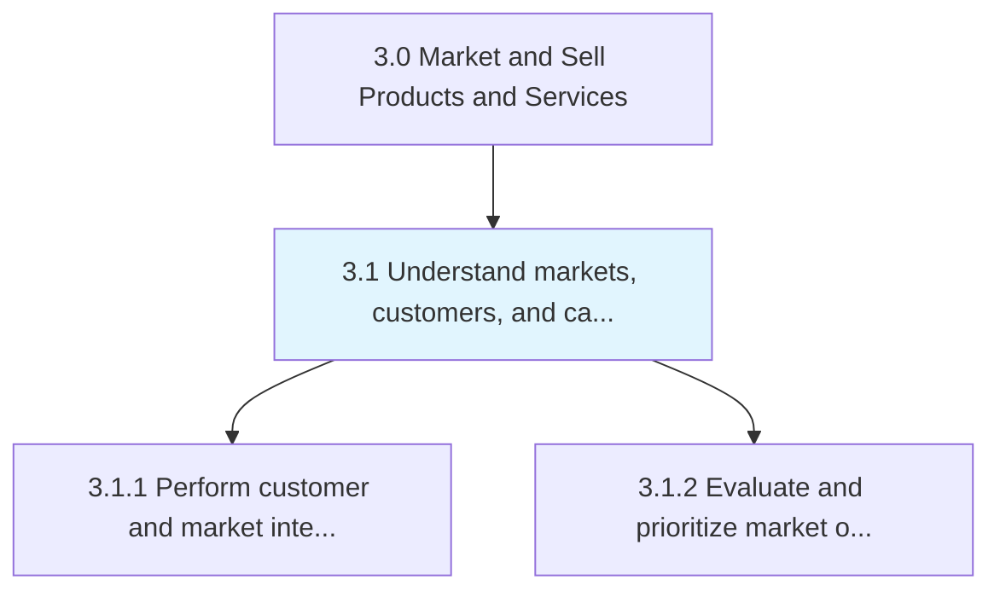
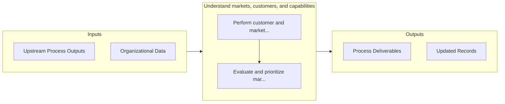

# Understand markets, customers, and capabilities

> Making sense of the market and customers to identify the right opportunities to be capitalized, given the organization's competencies.

## Overview

Group 3.1 is a process group within APQC Category 3.0 (Market and Sell Products and Services). 

Making sense of the market and customers to identify the right opportunities to be capitalized, given the organization's competencies. Discern trends and shift in the market and customers. Identify the right market opportunities that fit closely with the organization's capabilities and strategy by gathering intelligence on various attributes of different market/customer segments.

## Process Hierarchy



## Key Statistics

| Metric | Value |
|--------|-------|
| APQC Code | 10101 |
| Hierarchy ID | 3.1 |
| Level | Group |
| Parent | [3](../) |
| Sub-Processes | 2 |


## GraphDL Semantic Structure

```
understand.MarketsCustomersAndCapabilities
```

| Component | Value | Description |
|-----------|-------|-------------|
| Verb | `understand` | Primary action |
| Object | `markets, customers, and capabilities` | Direct object |


## Process Flow



## Sub-Processes

| Process | Hierarchy ID | Description |
|---------|-------------|-------------|
| [Perform customer and market intelligence analysis](./3.1.1-PerformCustomerMarketIntelligence/) | 3.1.1 | Gathering intelligence on the market and customers |
| [Evaluate and prioritize market opportunities](./3.1.2-EvaluatePrioritizeMarketOpportunities/) | 3.1.2 | Appraising market opportunities by quantifying and subjecting them to prioritization, as well as val |


## Related Concepts

- [Markets](/concepts/Markets)
- [Customers](/concepts/Customers)
- [Capabilities](/concepts/Capabilities)


---

*Source: APQC PCF 10101 (3.1) - APQC*
