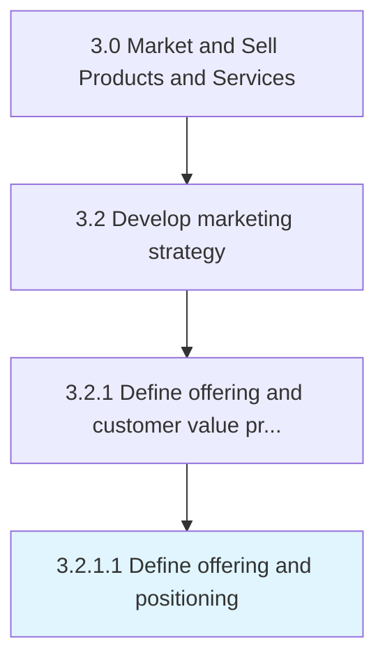

# Define offering and positioning

> Defining problem(s) that the organization's products/services solve for the customers, thereby determining how they are positioned in the market.

## Overview

Activity 3.2.1.1 is an activity within the Market and Sell Products and Services framework. 

Defining problem(s) that the organization's products/services solve for the customers, thereby determining how they are positioned in the market. Refine the product/service concepts from the perspective of customers. Succinctly outline the problem the organization's offerings solves for the customers, making a case for why the customer should buy a product or use a service. Define the offering's unique value.

## Process Hierarchy



## Key Statistics

| Metric | Value |
|--------|-------|
| APQC Code | 11169 |
| Hierarchy ID | 3.2.1.1 |
| Level | Activity |
| Parent | [3.2.1](../) |
| Sub-Processes | 0 |


## GraphDL Semantic Structure

```
define.OfferingAndPositioning
```

| Component | Value | Description |
|-----------|-------|-------------|
| Verb | `define` | Primary action |
| Object | `offering and positioning` | Direct object |


## Related Concepts

- [Offering](/concepts/Offering)
- [Positioning](/concepts/Positioning)


---

*Source: APQC PCF 11169 (3.2.1.1) - APQC*
