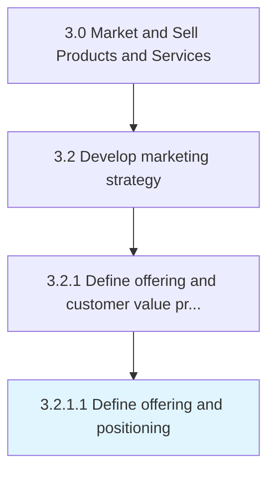

# Define offering and positioning

> Defining problem(s) that the organization's products/services solve for the customers, thereby determining how they are positioned in the market.

## Overview

Activity 3.2.1.1 is an activity within the Market and Sell Products and Services framework.

Defining problem(s) that the organization's products/services solve for the customers, thereby determining how they are positioned in the market. Refine the product/service concepts from the perspective of customers. Succinctly outline the problem the organization's offerings solves for the customers, making a case for why the customer should buy a product or use a service. Define the offering's unique value.

This process is critical to effective sales and marketing execution. It ensures that activities are systematically planned, executed, and measured against organizational objectives. When performed effectively, this process drives revenue growth, enhances customer engagement, and strengthens competitive positioning in target markets.

## Process Hierarchy



## Key Statistics

| Metric | Value |
|--------|-------|
| APQC Code | 11169 |
| Hierarchy ID | 3.2.1.1 |
| Level | Activity |
| Parent | [3.2.1](../) |
| Sub-Processes | 0 |

## Process Flow


## GraphDL Semantic Structure

```
define.OfferingAndPositioning
```

| Component | Value | Description |
|-----------|-------|-------------|
| Verb | `define` | Primary action |
| Object | `offering and positioning` | Direct object |


## RACI Matrix

| Role | Responsible | Accountable | Consulted | Informed |
|------|:-----------:|:-----------:|:---------:|:--------:|
| Marketing Manager | R |  |  |  |
| CMO / VP Marketing |  | A |  |  |
| Sales Manager |  |  | C |  |
| Product Manager |  |  | C |  |
| Finance Manager |  |  |  | I |

## Related Occupations

- [Marketing Managers](/occupations/Management/MarketingManagers)
- [Advertising And Promotions Managers](/occupations/Management/AdvertisingAndPromotionsManagers)
- [Market Research Analysts](/occupations/Business-and-Financial-Operations/MarketResearchAnalysts)
- [Public Relations Specialists](/occupations/Media-and-Communication/PublicRelationsSpecialists)
- [Sales Managers](/occupations/Management/SalesManagers)

## Related Departments

- [Marketing](/departments/Marketing)
- [Product Management](/departments/ProductManagement)
- [Sales](/departments/Sales)

## Industry Variations

### Consumer Products

In consumer products, define offering and positioning centers on brand positioning across multiple product lines, seasonal marketing calendars, and trade marketing strategies.

### Technology

In technology, define offering and positioning emphasizes digital-first strategies, developer community engagement, and product-led growth approaches.

### Life Sciences

In life sciences, define offering and positioning must comply with FDA advertising regulations, focus on HCP engagement, and navigate complex approval processes for promotional materials.

## KPIs & Metrics

| Metric | Description | Target |
|--------|-------------|--------|
| Brand Awareness | Percentage of target market aware of brand and value proposition | >60% |
| Channel ROI | Return on investment across marketing channels | >3:1 |
| Customer Acquisition Cost (CAC) | Average cost to acquire a new customer | Below industry benchmark |
| Marketing Qualified Leads (MQLs) | Number of qualified leads generated by marketing | Quarter-over-quarter growth |

## Related Concepts

- Offering
- Positioning

---

*Source: APQC PCF 11169 (3.2.1.1) - APQC*
