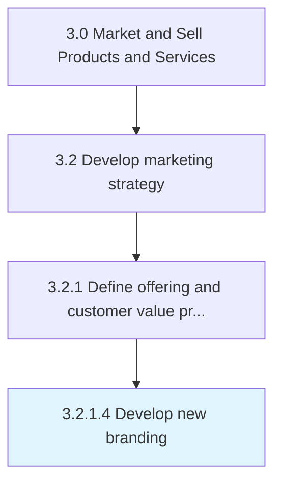

# Develop new branding

> Creating branding collaterals and campaigns that carve a significant and differentiated presence for the organization's offerings.

## Overview

Activity 3.2.1.4 is an activity within the Market and Sell Products and Services framework. 

Creating branding collaterals and campaigns that carve a significant and differentiated presence for the organization's offerings. Create new collaterals, which include names, designs, and symbols, for their products/services. Ensure collaterals reflect the unique value proposition of the respective offerings through a consistent theme. Create advertising and promotion campaigns.

## Process Hierarchy



## Key Statistics

| Metric | Value |
|--------|-------|
| APQC Code | 11172 |
| Hierarchy ID | 3.2.1.4 |
| Level | Activity |
| Parent | [3.2.1](../) |
| Sub-Processes | 0 |


## GraphDL Semantic Structure

```
develop.NewBranding
```

| Component | Value | Description |
|-----------|-------|-------------|
| Verb | `develop` | Primary action |
| Object | `new branding` | Direct object |


## Related Concepts

- [NewBranding](/concepts/NewBranding)


---

*Source: APQC PCF 11172 (3.2.1.4) - APQC*
