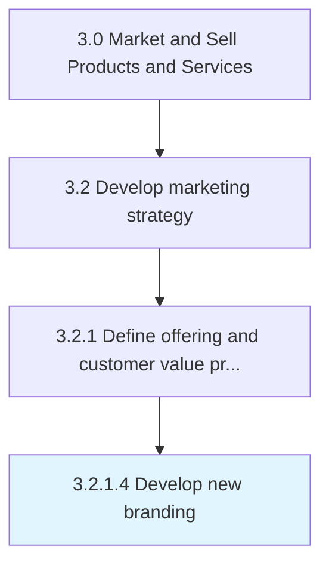

# Develop new branding

> Creating branding collaterals and campaigns that carve a significant and differentiated presence for the organization's offerings.

## Overview

Activity 3.2.1.4 is an activity within the Market and Sell Products and Services framework.

Creating branding collaterals and campaigns that carve a significant and differentiated presence for the organization's offerings. Create new collaterals, which include names, designs, and symbols, for their products/services. Ensure collaterals reflect the unique value proposition of the respective offerings through a consistent theme. Create advertising and promotion campaigns.

This process is critical to effective sales and marketing execution. It ensures that activities are systematically planned, executed, and measured against organizational objectives. When performed effectively, this process drives revenue growth, enhances customer engagement, and strengthens competitive positioning in target markets.

## Process Hierarchy



## Key Statistics

| Metric | Value |
|--------|-------|
| APQC Code | 11172 |
| Hierarchy ID | 3.2.1.4 |
| Level | Activity |
| Parent | [3.2.1](../) |
| Sub-Processes | 0 |

## Process Flow


## GraphDL Semantic Structure

```
develop.NewBranding
```

| Component | Value | Description |
|-----------|-------|-------------|
| Verb | `develop` | Primary action |
| Object | `new branding` | Direct object |


## RACI Matrix

| Role | Responsible | Accountable | Consulted | Informed |
|------|:-----------:|:-----------:|:---------:|:--------:|
| Marketing Manager | R |  |  |  |
| CMO / VP Marketing |  | A |  |  |
| Sales Manager |  |  | C |  |
| Product Manager |  |  | C |  |
| Finance Manager |  |  |  | I |

## Related Occupations

- [Marketing Managers](/occupations/Management/MarketingManagers)
- [Advertising And Promotions Managers](/occupations/Management/AdvertisingAndPromotionsManagers)
- [Market Research Analysts](/occupations/Business-and-Financial-Operations/MarketResearchAnalysts)
- [Public Relations Specialists](/occupations/Media-and-Communication/PublicRelationsSpecialists)
- [Sales Managers](/occupations/Management/SalesManagers)

## Related Departments

- [Marketing](/departments/Marketing)
- [Product Management](/departments/ProductManagement)
- [Sales](/departments/Sales)

## Industry Variations

### Consumer Products

In consumer products, develop new branding centers on brand positioning across multiple product lines, seasonal marketing calendars, and trade marketing strategies.

### Technology

In technology, develop new branding emphasizes digital-first strategies, developer community engagement, and product-led growth approaches.

### Life Sciences

In life sciences, develop new branding must comply with FDA advertising regulations, focus on HCP engagement, and navigate complex approval processes for promotional materials.

## KPIs & Metrics

| Metric | Description | Target |
|--------|-------------|--------|
| Brand Awareness | Percentage of target market aware of brand and value proposition | >60% |
| Channel ROI | Return on investment across marketing channels | >3:1 |
| Customer Acquisition Cost (CAC) | Average cost to acquire a new customer | Below industry benchmark |
| Marketing Qualified Leads (MQLs) | Number of qualified leads generated by marketing | Quarter-over-quarter growth |

## Related Concepts

- NewBranding

---

*Source: APQC PCF 11172 (3.2.1.4) - APQC*
